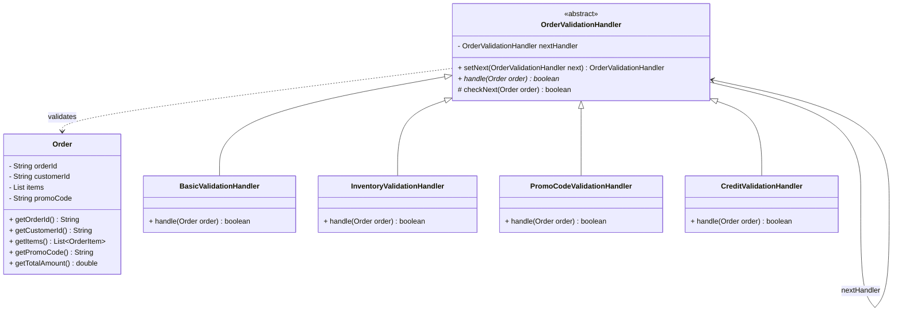

# Chain of Responsibility Pattern (Mẫu Chuỗi Trách Nhiệm)

## Overview
**Chain of Responsibility** là một design pattern thuộc nhóm **Behavioral** (Hành vi). Mẫu thiết kế này cho phép bạn chuyển giao các yêu cầu (requests) dọc theo một chuỗi các đối tượng xử lý (handlers). Khi nhận được một yêu cầu, mỗi handler sẽ quyết định xử lý yêu cầu đó hoặc chuyển giao nó cho handler tiếp theo trong chuỗi.

---

## Problem

### What problem exists?
Trong một hệ thống E-commerce, trước khi một đơn hàng (`Order`) được xử lý và lưu vào cơ sở dữ liệu, nó phải đi qua một loạt các bước kiểm tra tính hợp lệ (Validation Pipeline):
1. **Basic Validation**: Kiểm tra xem đơn hàng có đầy đủ thông tin bắt buộc hay không (Order ID, Customer ID, danh sách sản phẩm không rỗng, số lượng/giá bán hợp lệ).
2. **Inventory Validation**: Kiểm tra xem kho còn đủ số lượng sản phẩm để đáp ứng đơn hàng hay không.
3. **Promo Code Validation**: Kiểm tra tính hợp lệ của mã giảm giá (nếu có).
4. **Credit/Balance Validation**: Kiểm tra số dư tài khoản của khách hàng có đủ thanh toán tổng tiền đơn hàng hay không.

### Why traditional implementation fails?
Nếu triển khai theo cách truyền thống (trong [OrderValidationService.java (before)](file:///f:/Learning/java-design-patterns-playground/behavioral/chain_of_responsibility/before/OrderValidationService.java)), chúng ta sẽ viết một lớp duy nhất chứa tất cả các logic kiểm tra này thông qua các khối lệnh `if-else` tuần tự hoặc lồng nhau:

```java
public boolean validate(Order order) {
    // 1. Kiểm tra thông tin cơ bản
    if (order.getOrderId() == null || order.getItems().isEmpty()) { return false; }
    
    // 2. Kiểm tra tồn kho
    for (OrderItem item : order.getItems()) {
        if (getStock(item.getProductId()) < item.getQuantity()) { return false; }
    }
    
    // 3. Kiểm tra mã giảm giá
    if (order.getPromoCode() != null && !isValidPromo(order.getPromoCode())) { return false; }
    
    // 4. Kiểm tra số dư tài khoản
    if (getBalance(order.getCustomerId()) < order.getTotalAmount()) { return false; }
    
    return true;
}
```

Cách làm này gặp phải các nhược điểm lớn sau:
1. **Khó bảo trì và mở rộng**: Khi cần bổ sung thêm một bước kiểm tra mới (ví dụ: kiểm tra gian lận - Fraud Check, kiểm tra địa chỉ giao hàng - Address Check), ta buộc phải thay đổi trực tiếp mã nguồn của lớp `OrderValidationService`.
2. **Vi phạm nguyên tắc đóng gói**: Logic nghiệp vụ của các hệ thống khác nhau (Inventory, Promotion, Billing) bị gộp chung vào một nơi duy nhất, gây khó khăn cho việc đọc, hiểu và kiểm thử độc lập.
3. **Không linh hoạt**: Khó có thể thay đổi thứ tự thực hiện các bước kiểm tra hoặc tái cấu trúc chuỗi chạy động tùy thuộc vào loại đơn hàng (ví dụ: đơn hàng kỹ thuật số - Digital Goods không cần kiểm tra tồn kho vật lý).

### Which SOLID principle is violated?
* **Single Responsibility Principle (SRP)**: Lớp `OrderValidationService` gánh vác quá nhiều trách nhiệm kiểm tra thuộc các miền nghiệp vụ khác nhau (kho, thanh toán, khuyến mãi).
* **Open/Closed Principle (OCP)**: Lớp không đóng đối với việc sửa đổi. Việc thêm hoặc bớt quy tắc kiểm tra yêu cầu chỉnh sửa mã nguồn hiện tại của lớp, tăng nguy cơ gây lỗi cho các logic cũ đang chạy ổn định.

---

## Solution

Chain of Responsibility giải quyết triệt để vấn đề này bằng cách:
1. Tách biệt mỗi quy tắc kiểm tra thành một lớp xử lý riêng biệt kế thừa từ một lớp trừu tượng chung hoặc giao diện chung (`OrderValidationHandler`). Mỗi lớp này được gọi là một **Concrete Handler**.
2. Liên kết các handler này lại với nhau thành một chuỗi tuần tự (Chain).
3. Mỗi handler sẽ nhận đơn hàng, thực hiện kiểm tra phần việc của mình.
   * Nếu kiểm tra **thất bại**: Handler dừng chuỗi bằng cách trả về `false` ngay lập tức.
   * Nếu kiểm tra **thành công**: Handler sẽ gọi phương thức chuyển giao yêu cầu cho handler tiếp theo trong chuỗi.

---

## UML Diagram



---

## Code Explanation

Dưới đây là chi tiết thiết kế và giải thích các mã nguồn tương ứng:

### 1. Pure Java Implementation (Sau khi cấu trúc lại)

* **Giao diện chuỗi**: [OrderValidationHandler.java](file:///f:/Learning/java-design-patterns-playground/behavioral/chain_of_responsibility/after/OrderValidationHandler.java) định nghĩa thuộc tính liên kết `nextHandler` và phương thức trợ giúp chuyển tiếp `checkNext(order)`.
* **Concrete Handlers**:
  * [BasicValidationHandler.java](file:///f:/Learning/java-design-patterns-playground/behavioral/chain_of_responsibility/after/BasicValidationHandler.java): Kiểm tra tính toàn vẹn cơ bản.
  * [InventoryValidationHandler.java](file:///f:/Learning/java-design-patterns-playground/behavioral/chain_of_responsibility/after/InventoryValidationHandler.java): Thực hiện kiểm tra tồn kho.
  * [PromoCodeValidationHandler.java](file:///f:/Learning/java-design-patterns-playground/behavioral/chain_of_responsibility/after/PromoCodeValidationHandler.java): Xác minh mã giảm giá.
  * [CreditValidationHandler.java](file:///f:/Learning/java-design-patterns-playground/behavioral/chain_of_responsibility/after/CreditValidationHandler.java): Đảm bảo số dư khách hàng đủ khả năng thanh toán.
* **Cách khởi tạo chuỗi bằng Pure Java**:
  ```java
  OrderValidationHandler validationChain = new BasicValidationHandler();
  validationChain.setNext(new InventoryValidationHandler())
                 .setNext(new PromoCodeValidationHandler())
                 .setNext(new CreditValidationHandler());
                 
  // Thực thi
  boolean isValid = validationChain.handle(order);
  ```

---

### 2. Spring Boot Implementation (Khuyên dùng cho ứng dụng Enterprise)

Trong Spring Boot, chúng ta không cần kết nối thủ công các handler bằng `setNext`. Thay vào đó, ta tận dụng sức mạnh của **Dependency Injection (DI)** và **Bean Management**:

* **Interface chung**: [OrderValidationHandler.java](file:///f:/Learning/java-design-patterns-playground/behavioral/chain_of_responsibility/spring/OrderValidationHandler.java) định nghĩa một phương thức `boolean handle(Order order)`.
* **Định nghĩa các Bean**: Mỗi handler cụ thể như [BasicValidationHandler.java](file:///f:/Learning/java-design-patterns-playground/behavioral/chain_of_responsibility/spring/BasicValidationHandler.java) được đánh dấu là `@Component` và được gán chỉ mục ưu tiên bằng `@Order(value)`:
  * `@Order(1)` cho `BasicValidationHandler`
  * `@Order(2)` cho `InventoryValidationHandler`
  * `@Order(3)` cho `PromoCodeValidationHandler`
  * `@Order(4)` cho `CreditValidationHandler`
* **Pipeline tự động**: [OrderValidationPipeline.java](file:///f:/Learning/java-design-patterns-playground/behavioral/chain_of_responsibility/spring/OrderValidationPipeline.java) sẽ inject tự động danh sách tất cả các Bean kế thừa `OrderValidationHandler`. Spring tự động sắp xếp các handler này trong List dựa trên giá trị `@Order`:
  ```java
  @Service
  public class OrderValidationPipeline {
      private final List<OrderValidationHandler> handlers;
  
      @Autowired
      public OrderValidationPipeline(List<OrderValidationHandler> handlers) {
          this.handlers = handlers; // Đã được Spring sắp xếp theo thứ tự @Order
      }
  
      public boolean validate(Order order) {
          for (OrderValidationHandler handler : handlers) {
              if (!handler.handle(order)) {
                  return false; // Ngắt chuỗi (fail-fast)
              }
          }
          return true; // Tất cả bước kiểm tra đều hợp lệ
      }
  }
  ```

> [!TIP]
> **Điểm ưu việt của giải pháp Spring Boot**:
> Khi cần thêm một bước kiểm tra mới (ví dụ `FraudValidationHandler`), bạn chỉ cần tạo lớp mới kế thừa `OrderValidationHandler`, gắn `@Component` và chỉ định `@Order(5)`. Không cần sửa đổi bất kỳ dòng mã nào trong `OrderValidationPipeline` hay các handler khác. Hệ thống tự động phát hiện và lắp ghép bước kiểm tra mới này vào chuỗi tại runtime!

---

## Advantages & Disadvantages

### Advantages (Ưu điểm)
* **Đảm bảo SRP (Single Responsibility Principle)**: Mỗi quy tắc kiểm tra chỉ tập trung vào một nghiệp vụ duy nhất.
* **Đảm bảo OCP (Open/Closed Principle)**: Dễ dàng thêm hoặc bớt các handler vào hệ thống mà không ảnh hưởng tới code cũ.
* **Fail-Fast**: Ngắt tiến trình ngay lập tức khi một bước kiểm tra không hợp lệ, giúp tối ưu hiệu năng và tiết kiệm tài nguyên (ví dụ: nếu thông tin đơn hàng cơ bản không hợp lệ, hệ thống sẽ từ chối ngay mà không cần truy vấn database kho hay tài khoản thanh toán).
* **Linh hoạt kết nối**: Cho phép thiết lập cấu hình thứ tự chuỗi động tại runtime.

### Disadvantages (Nhược điểm)
* **Không đảm bảo yêu cầu được xử lý**: Nếu chuỗi không được cấu hình đúng hoặc không có handler nào phù hợp cuối chuỗi, yêu cầu có thể đi qua hết chuỗi mà không được xử lý (trong trường hợp của pipeline validation thì mặc định trả về `true` là hợp lý).
* **Khó khăn khi gỡ lỗi (Debugging)**: Do luồng đi qua nhiều đối tượng trung gian một cách động, việc trace log hoặc debug từng bước kiểm tra có thể phức tạp hơn so với cấu trúc `if-else` tuần tự truyền thống.

---

## Use Cases (Trường hợp áp dụng)
* **Đường ống Validation & Filter**: Kiểm tra dữ liệu đầu vào của các Request (ví dụ: HTTP Filters, Validation Pipelines).
* **Xử lý sự kiện (Event Handling)**: Trong các giao diện UI (ví dụ: sự kiện Click chuột được chuyển giao từ nút bấm -> panel chứa nút -> cửa sổ chính cho đến khi có đối tượng xử lý).
* **Hệ thống Logging**: Định tuyến các tin nhắn log theo cấp độ (`DEBUG`, `INFO`, `ERROR`) qua các handler tương ứng (ghi file, gửi email, đẩy lên Elasticsearch).

---

## Related Patterns (Mẫu thiết kế liên quan)
* **Composite**: Thường được dùng kết hợp khi một Handler trong chuỗi là một nhóm các Handler con khác.
* **Command**: Có thể đóng gói yêu cầu gửi đi thành một đối tượng `Command` và chuyển nó dọc theo chuỗi.
* **Decorator**: Thay đổi hành vi của đối tượng bằng cách bọc nó, trong khi Chain of Responsibility thay đổi hành vi bằng cách chuyển giao yêu cầu.

---

## References
1. Gamma, E., Helm, R., Johnson, R., & Vlissides, J. (1994). *Design Patterns: Elements of Reusable Object-Oriented Software*. Addison-Wesley.
2. Refactoring.Guru - [Chain of Responsibility Pattern](https://refactoring.guru/design-patterns/chain-of-responsibility).
