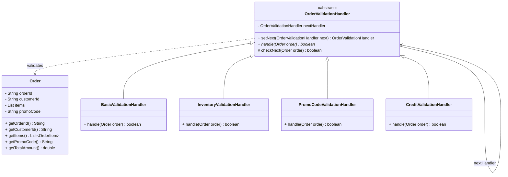

# Chain of Responsibility Pattern

## Overview
**Chain of Responsibility** is a **behavioral design pattern** that lets you pass requests along a chain of handlers. Upon receiving a request, each handler decides either to process the request or to pass it to the next handler in the chain.

---

## Problem

### What problem exists?
In an E-commerce system, before an `Order` is processed and saved to the database, it must pass through a sequence of validation steps (Validation Pipeline):
1. **Basic Validation**: Ensures mandatory order details are present (valid Order ID, Customer ID, non-empty items, and positive quantity/unit price).
2. **Inventory Validation**: Verifies if there is sufficient stock in the warehouse for each ordered item.
3. **Promo Code Validation**: Checks if the applied promo code is valid (if provided).
4. **Credit/Balance Validation**: Confirms that the customer has a sufficient credit limit or account balance to pay for the order.

### Why traditional implementation fails?
In a traditional approach (as seen in [OrderValidationService.java (before)](file:///f:/Learning/java-design-patterns-playground/behavioral/chain_of_responsibility/before/OrderValidationService.java)), all validations are implemented in a single service class using nested or sequential `if-else` blocks:

```java
public boolean validate(Order order) {
    // 1. Basic validation
    if (order.getOrderId() == null || order.getItems().isEmpty()) { return false; }
    
    // 2. Inventory check
    for (OrderItem item : order.getItems()) {
        if (getStock(item.getProductId()) < item.getQuantity()) { return false; }
    }
    
    // 3. Promo code check
    if (order.getPromoCode() != null && !isValidPromo(order.getPromoCode())) { return false; }
    
    // 4. Balance check
    if (getBalance(order.getCustomerId()) < order.getTotalAmount()) { return false; }
    
    return true;
}
```

This monolithic structure has major disadvantages:
1. **Difficult to Maintain and Extend**: Adding a new validation rule (e.g., Fraud Check, Shipping Address Verification) requires modifying the source code of `OrderValidationService`.
2. **Tight Coupling**: Business rules for inventory, promotions, and billing are consolidated in one place, making it hard to read, maintain, and unit test in isolation.
3. **Inflexible Order**: It is difficult to dynamically reorder validation steps or bypass specific steps based on request parameters (e.g., skipping physical inventory checks for digital products).

### Which SOLID principles are violated?
* **Single Responsibility Principle (SRP)**: The `OrderValidationService` is overloaded with multiple responsibilities spanning diverse domains (inventory database checks, promotion logic, customer credit accounts).
* **Open/Closed Principle (OCP)**: The class is open for modification. Adding or removing validation logic requires altering the core source code of the service, raising regression risks.

---

## Solution

The Chain of Responsibility pattern addresses these issues by:
1. Extracting each validation step into its own class (called a **Concrete Handler**) that implements a common interface or abstract class (`OrderValidationHandler`).
2. Linking these handlers sequentially into a chain.
3. Handing the request to the first handler in the chain:
   * If validation **fails**: The handler terminates the chain immediately by returning `false` (Fail-Fast).
   * If validation **passes**: The handler delegates the request to the next handler in the chain.

---

## UML Diagram



---

## Code Explanation

Here is the design details and structure of our implementation:

### 1. Pure Java Implementation (After Refactoring)

* **Chain Abstraction**: [OrderValidationHandler.java](file:///f:/Learning/java-design-patterns-playground/behavioral/chain_of_responsibility/after/OrderValidationHandler.java) defines the link attribute `nextHandler` and the forwarder method `checkNext(order)`.
* **Concrete Handlers**:
  * [BasicValidationHandler.java](file:///f:/Learning/java-design-patterns-playground/behavioral/chain_of_responsibility/after/BasicValidationHandler.java): Handles baseline structural integrity validation.
  * [InventoryValidationHandler.java](file:///f:/Learning/java-design-patterns-playground/behavioral/chain_of_responsibility/after/InventoryValidationHandler.java): Handles mock stock check validation.
  * [PromoCodeValidationHandler.java](file:///f:/Learning/java-design-patterns-playground/behavioral/chain_of_responsibility/after/PromoCodeValidationHandler.java): Validates mock promotion codes.
  * [CreditValidationHandler.java](file:///f:/Learning/java-design-patterns-playground/behavioral/chain_of_responsibility/after/CreditValidationHandler.java): Validates customer balance availability.
* **Assembling the Chain manually in Pure Java**:
  ```java
  OrderValidationHandler validationChain = new BasicValidationHandler();
  validationChain.setNext(new InventoryValidationHandler())
                 .setNext(new PromoCodeValidationHandler())
                 .setNext(new CreditValidationHandler());
                 
  // Execute validation
  boolean isValid = validationChain.handle(order);
  ```

---

### 2. Spring Boot Implementation (Recommended for Enterprise Applications)

In Spring Boot, we do not need to link handlers manually using `setNext`. We leverage **Dependency Injection (DI)** and **Bean Management**:

* **Giao diện chung**: [OrderValidationHandler.java](file:///f:/Learning/java-design-patterns-playground/behavioral/chain_of_responsibility/spring/OrderValidationHandler.java) defines a single `boolean handle(Order order)` method.
* **Bean Definitions**: Each concrete handler like [BasicValidationHandler.java](file:///f:/Learning/java-design-patterns-playground/behavioral/chain_of_responsibility/spring/BasicValidationHandler.java) is annotated with `@Component` and assigned an execution priority with `@Order(value)`:
  * `@Order(1)` for `BasicValidationHandler`
  * `@Order(2)` for `InventoryValidationHandler`
  * `@Order(3)` for `PromoCodeValidationHandler`
  * `@Order(4)` for `CreditValidationHandler`
* **Automated Pipeline**: [OrderValidationPipeline.java](file:///f:/Learning/java-design-patterns-playground/behavioral/chain_of_responsibility/spring/OrderValidationPipeline.java) automatically injects the list of all registered beans implementing `OrderValidationHandler`. Spring automatically sorts them according to the `@Order` values:
  ```java
  @Service
  public class OrderValidationPipeline {
      private final List<OrderValidationHandler> handlers;
  
      @Autowired
      public OrderValidationPipeline(List<OrderValidationHandler> handlers) {
          this.handlers = handlers; // Autowired list, pre-sorted by Spring using @Order
      }
  
      public boolean validate(Order order) {
          for (OrderValidationHandler handler : handlers) {
              if (!handler.handle(order)) {
                  return false; // Fail-fast pipeline stop
              }
          }
          return true; // All checks passed
      }
  }
  ```

> [!TIP]
> **Key benefit of the Spring Boot approach**:
> To introduce a new validation step (e.g., `FraudValidationHandler`), simply create a new class implementing `OrderValidationHandler` annotated with `@Component` and `@Order(5)`. You do not need to modify `OrderValidationPipeline` or any other validation classes. Spring detects it and adds it into the pipeline automatically at startup!

---

## Advantages & Disadvantages

### Advantages
* **Single Responsibility Principle (SRP)**: You can decouple classes that invoke operations from classes that perform operations.
* **Open/Closed Principle (OCP)**: You can introduce new handlers into the app without breaking existing client code.
* **Fail-Fast Efficiency**: Short-circuits execution as soon as a validation failure is detected, avoiding heavy downstream operations (e.g., database writes or credit reserve requests).
* **Flexibility**: You can configure the sequence of handlers dynamically at runtime.

### Disadvantages
* **Unhandled Requests**: A request might pass through the entire chain without being handled if no handler consumes it (in this validation pipeline, this defaults to returning `true`, which is acceptable).
* **Harder to Debug**: Tracing code execution through deep dynamic handler chains can be more complex than auditing a single centralized monolithic `if-else` method.

---

## Use Cases
* **Request Processing Filters**: HTTP request preprocessing pipelines (e.g., authentication, logging, rate limiting, and parameter validation).
* **UI Event Propagation**: Propagating events through components hierarchically (e.g., from button to container panel, to root window) until handled.
* **Log Handlers**: Passing messages down a pipeline of log destination writers (e.g., console writer, file logger, remote notification channel).

---

## Related Patterns
* **Composite**: Often used in combination where a member of the handler chain is itself a collection of sub-handlers.
* **Command**: Can be used to encapsulate a request as an object, which is then sent along the handler chain.
* **Decorator**: Modifies an object's behavior dynamically by wrapping it, whereas Chain of Responsibility passes requests through a sequence of separate entities.

---

## References
1. Gamma, E., Helm, R., Johnson, R., & Vlissides, J. (1994). *Design Patterns: Elements of Reusable Object-Oriented Software*. Addison-Wesley.
2. Refactoring.Guru - [Chain of Responsibility Pattern](https://refactoring.guru/design-patterns/chain-of-responsibility).
