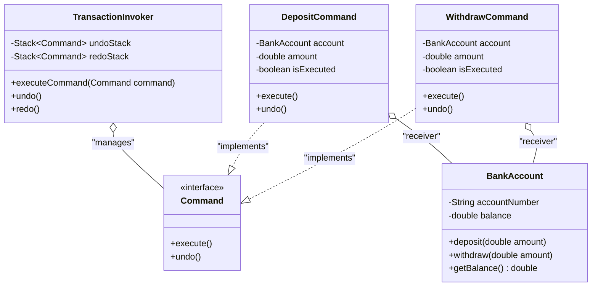

# Command Pattern

## Overview
**Command Pattern** là một design pattern thuộc nhóm **Behavioral** (Hành vi). Nó chuyển đổi một yêu cầu (request) thành một đối tượng độc lập chứa tất cả thông tin về yêu cầu đó. Sự chuyển đổi này cho phép bạn tham số hóa các client với các yêu cầu khác nhau, trì hoãn hoặc xếp hàng thực thi một yêu cầu, và hỗ trợ các thao tác không thể đảo ngược (undo/redo).

## Problem
### What problem exists?
Trong một ứng dụng ngân hàng, chúng ta cần thực hiện các giao dịch như gửi tiền (`deposit`), rút tiền (`withdraw`) trên tài khoản. Ngoài ra, hệ thống yêu cầu khả năng hoàn tác (**Undo**) các giao dịch vừa thực hiện để khôi phục trạng thái số dư trước đó.

### Why traditional implementation fails?
Với cách tiếp cận truyền thống (như trong [TransactionServiceBefore.java](file:///f:/Learning/java-design-patterns-playground/behavioral/command/before/TransactionServiceBefore.java)), một class dịch vụ `TransactionServiceBefore` sẽ trực tiếp gọi các phương thức sửa đổi số dư của `BankAccountBefore`. 
Để hỗ trợ tính năng **Undo**, `TransactionServiceBefore` phải lưu lại danh sách lịch sử loại giao dịch (dưới dạng String) cùng số tiền, sau đó dùng các cấu trúc điều kiện `if-else` phức tạp để thực hiện thao tác ngược lại (ví dụ: hoàn tác của gửi tiền là rút tiền, và ngược lại).
Khi hệ thống mở rộng, thêm các loại giao dịch mới (như thanh toán hóa đơn, tính lãi suất), class này sẽ phình to nhanh chóng, cực kỳ khó bảo trì và dễ xảy ra lỗi logic khi đảo ngược giao dịch.

### Which SOLID principle is violated?
Cách tiếp cận này vi phạm nghiêm trọng:
- **Open/Closed Principle (OCP)**: Mỗi khi thêm một loại giao dịch hoặc thay đổi logic đảo ngược, ta buộc phải mở class `TransactionServiceBefore` ra để sửa đổi.
- **Single Responsibility Principle (SRP)**: `TransactionServiceBefore` vừa phải quản lý lịch sử giao dịch, vừa phải biết rõ logic chi tiết và phương pháp đảo ngược của từng loại giao dịch khác nhau.

## Solution
Command Pattern tách biệt đối tượng yêu cầu thực thi giao dịch (Client/Invoker) khỏi đối tượng thực sự hiểu cách thực hiện hành động đó (Receiver - `BankAccount`).
1. Định nghĩa interface `Command` đại diện cho một yêu cầu thực thi với hai phương thức `execute()` và `undo()`.
2. Tạo các class concrete command như `DepositCommand` và `WithdrawCommand`. Mỗi command sẽ đóng gói Receiver (`BankAccount`) và các tham số cần thiết (như số tiền `amount`).
3. Class `TransactionInvoker` (người gọi) sẽ giữ một lịch sử của các đối tượng `Command` (dưới dạng Stack). Khi cần Undo hoặc Redo, nó chỉ cần gọi phương thức `undo()` hoặc `execute()` trên command tương ứng mà không cần quan tâm command đó là gì hay xử lý số dư thế nào.

## UML Diagram

## Advantages
- **Giảm liên kết (Decoupling)**: Decouple hoàn toàn đối tượng kích hoạt yêu cầu và đối tượng thực thi yêu cầu.
- **Dễ mở rộng (OCP)**: Có thể dễ dàng thêm các Command mới (ví dụ: `TransferCommand`) mà không làm thay đổi code hiện có của Invoker hay các Command khác.
- **Hỗ trợ Undo/Redo**: Lưu trữ trạng thái và lịch sử thực thi trực tiếp trong các command object giúp việc hoàn tác cực kỳ đơn giản và an toàn.
- **Tạo các lệnh phức hợp (Macro Command)**: Dễ dàng gom nhiều command đơn lẻ thành một chuỗi các command để thực hiện tuần tự.

## Disadvantages
- **Tăng số lượng class**: Do mỗi loại thao tác cụ thể đều cần tạo một class riêng biệt thực thi `Command`.
- **Độ phức tạp tăng**: Cần tổ chức cấu trúc hợp lý để quản lý vòng đời và tham số truyền vào các Command object.

## Use Cases
| Pattern | Business Use Case |
| ------- | ----------------- |
| **Command** | **Banking Transaction Systems** (Hệ thống giao dịch ngân hàng hỗ trợ rollback/undo) |
| **Command** | **Text Editor Operations** (Các thao tác như Undo/Redo, Copy, Paste, Format văn bản) |
| **Command** | **Task Queue / Job Scheduler** (Xếp hàng các tác vụ để luồng nền xử lý dần) |
| **Command** | **Smart Home Remote Control** (Các nút bấm trên remote được gán các lệnh bật/tắt thiết bị động) |

## Related Patterns
- **Memento**: Thường được dùng kết hợp với Command để lưu lại trạng thái nội bộ của receiver trước khi thực thi lệnh, phục vụ tính năng undo phức tạp hơn.
- **Prototype**: Được dùng khi cần sao chép các Command trước khi đưa vào lịch sử thực thi hoặc queue.
- **Strategy**: Cả hai đều đóng gói hành vi, nhưng Strategy tập trung vào việc hoán đổi các thuật toán giải quyết cùng một vấn đề, trong khi Command tập trung vào việc đóng gói các request khác nhau.

## Spring Boot Version
Phiên bản Spring Boot nằm trong package [spring](file:///f:/Learning/java-design-patterns-playground/behavioral/command/spring) minh họa mô hình **Command Dispatcher** rất phổ biến trong các hệ thống doanh nghiệp (Enterprise).
- Toàn bộ lệnh cụ thể (`DepositCommand`, `WithdrawCommand`) được đăng ký làm các `@Component` Spring.
- `TransactionService` đóng vai trò là Invoker/Dispatcher, tự động tiêm (`@Autowired`) danh sách tất cả các Bean implement `BankCommand` và đưa vào một `Map` quản lý.
- Khi nhận yêu cầu từ client, `TransactionService` sẽ lấy command tương ứng từ Map và thực hiện chạy nghiệp vụ, đảm bảo tính động và lỏng lẻo (loose coupling) cao nhất.

## References
- [Refactoring.guru - Command Pattern](https://refactoring.guru/design-patterns/command)
- [Head First Design Patterns (Book)]
