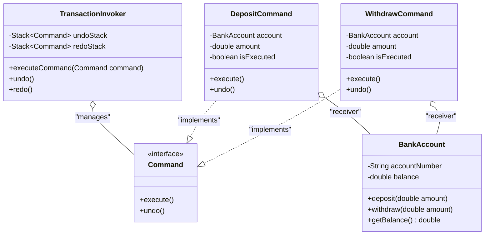

# Command Pattern

## Overview
The **Command Pattern** is a behavioral design pattern that turns a request into a stand-alone object that contains all information about the request. This transformation lets you pass requests as a method arguments, delay or queue a request's execution, and support undoable operations.

---

## 1. Problem Description

### What problem exists?
In a banking application, we need to execute transaction requests such as deposits and withdrawals on bank accounts. Additionally, the system must support an **Undo** mechanism to rollback transaction operations and restore the previous account balance state.

### Why traditional implementation fails?
In a traditional approach (like [TransactionServiceBefore.java](file:///f:/Learning/java-design-patterns-playground/behavioral/command/before/TransactionServiceBefore.java)), the service class maintains direct references to the receiver (`BankAccountBefore`). 
To support undo/redo, the service class is forced to track transaction history using collections of primitives or strings (e.g. tracking transaction type as a string and amount as a double) and write complex `if-else` or `switch-case` branches to figure out how to reverse each transaction type.
As new transaction types (e.g., transfers, bill payments, interest application) are added, this service class becomes bloated, difficult to maintain, and highly error-prone.

### Which SOLID principle is violated?
This traditional implementation directly violates:
- **Open/Closed Principle (OCP)**: Adding new transactions or changing how an operation is undone requires modifying the core `TransactionServiceBefore` class.
- **Single Responsibility Principle (SRP)**: The service class is overloaded with tracking history, validating business logic, and executing/undoing every concrete type of transaction.

---

## 2. Before Refactoring

```java
public class TransactionServiceBefore {
    private final BankAccountBefore account;
    private final List<String> history = new ArrayList<>();
    private final List<Double> amounts = new ArrayList<>();

    public void execute(String type, double amount) {
        if (type.equalsIgnoreCase("DEPOSIT")) {
            account.deposit(amount);
            history.add("DEPOSIT");
            amounts.add(amount);
        } else if (type.equalsIgnoreCase("WITHDRAW")) {
            account.withdraw(amount);
            history.add("WITHDRAW");
            amounts.add(amount);
        }
    }

    public void undo() {
        if (history.isEmpty()) return;
        int lastIndex = history.size() - 1;
        String type = history.remove(lastIndex);
        double amount = amounts.remove(lastIndex);
        
        if (type.equals("DEPOSIT")) {
            account.withdraw(amount); // reverse of deposit
        } else if (type.equals("WITHDRAW")) {
            account.deposit(amount);  // reverse of withdraw
        }
    }
}
```

---

## 3. Pattern Solution

By applying the Command Pattern, we abstract transaction operations into individual Command classes (`DepositCommand`, `WithdrawCommand`) implementing a shared `Command` interface. The `TransactionInvoker` acts as the sender, holding command stacks to execute, undo, and redo transactions without coupling to their concrete implementations.

```java
public interface Command {
    void execute();
    void undo();
}

public class DepositCommand implements Command {
    private final BankAccount account;
    private final double amount;
    private boolean isExecuted;

    public void execute() {
        account.deposit(amount);
        isExecuted = true;
    }

    public void undo() {
        if (isExecuted) {
            account.withdraw(amount);
        }
    }
}
```

---

## 4. UML Diagram



---

## 5. Unit Tests
See the `tests/` directory for full test coverage (>80%), covering:
- Happy paths for before and after refactored code.
- Edge cases like deposit/withdraw of negative/zero values.
- Failure states including withdrawing with insufficient funds and triggering undo/redo on empty history stacks.

---

## 6. Real-world Example

| Pattern | Business Use Case |
| ------- | ----------------- |
| **Command** | **Banking Transaction System** (Executing, queueing, and rolling back bank transactions) |

---

## 7. Spring Boot Version
See the `spring/` package for the Spring Boot implementation. It demonstrates the **Command Dispatcher** model:
- Specific commands are registered as Spring `@Component` beans.
- `TransactionService` autowires the list of command beans, indexing them by action name.
- Client requests are dynamically routed to their target command handlers, showing a decoupled enterprise-level architecture.

---

## Advantages
- **Decoupling**: Decouples the object that invokes the operation from the one that knows how to perform it.
- **Extensibility**: You can introduce new commands (like `TransferCommand`) without changing any existing client or invoker code (OCP).
- **Undo/Redo Support**: Storing states and histories inside command objects makes reversing and re-executing transactions extremely clean.
- **Composition**: Commands can be combined into composite macro commands (e.g., transactional batching).

## Disadvantages
- **Class Bloat**: The codebase gets larger as you have to introduce a new class for each individual operation.
- **Complexity**: Adds indirection between the sender and the receiver, making it harder to trace the flow of execution.

## Use Cases
- Bank transaction systems with transactional rollback.
- Document/graphic editor undo/redo functionality (e.g., Photoshop, Google Docs).
- Command Queuing and thread pools.
- Macro recording features.

## Related Patterns
- **Memento**: Often used with Command to store receiver snapshots for state rollback.
- **Prototype**: Used to clone a Command instance before pushing it to the history stack.
- **Strategy**: Both parameterize objects with behaviors, but Strategy focuses on swapping algorithms, whereas Command wraps requests/actions.

## References
- [Refactoring Guru - Command Pattern](https://refactoring.guru/design-patterns/command)
- [Head First Design Patterns (Book)]
