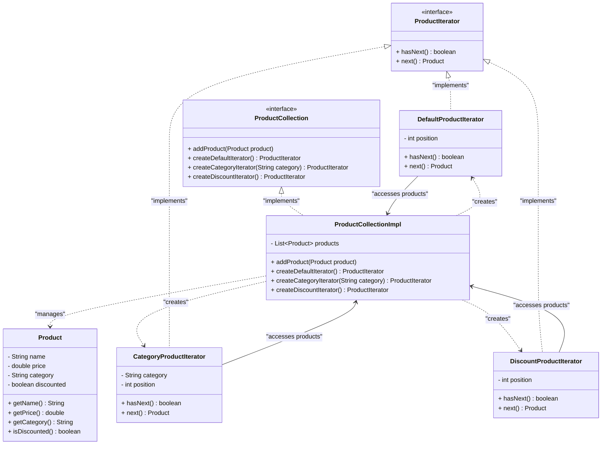

# Iterator Pattern

## Overview
**Iterator Pattern** là một design pattern thuộc nhóm **Behavioral** (Hành vi). Nó cung cấp một phương pháp giúp bạn truy cập tuần tự vào các phần tử của một đối tượng tập hợp (collection/aggregate) mà không cần phải để lộ cấu trúc lưu trữ bên dưới của đối tượng đó (ví dụ như danh sách liên kết, mảng, cây, đồ thị...).

Mẫu thiết kế này tách biệt trách nhiệm quản lý cấu trúc dữ liệu khỏi trách nhiệm duyệt qua cấu trúc dữ liệu đó, giúp client tương tác với các cấu trúc dữ liệu khác nhau theo một cách đồng nhất.

---

## Problem
### What problem exists?
Trong một ứng dụng quản lý kho hàng hoặc danh mục sản phẩm (`Product Catalog`), chúng ta lưu trữ các đối tượng sản phẩm (`Product`). Ban đầu, chúng ta sử dụng một danh sách `List<Product>` bên trong lớp `ProductCatalog`.

Để cho phép client (ví dụ lớp hiển thị giao diện, lớp báo cáo doanh thu) duyệt qua và xử lý các sản phẩm, chúng ta cung cấp một phương thức getter trả về trực tiếp danh sách đó: `getProducts()`.

### Why traditional implementation fails?
Cách tiếp cận này gặp phải các vấn đề sau:
1. **Lộ cấu trúc nội bộ**: Client biết chính xác rằng `ProductCatalog` đang sử dụng `List`. Nếu trong tương lai, chúng ta thay đổi cấu trúc lưu trữ từ `List` sang `Map` (để tối ưu tìm kiếm theo ID), sang mảng cố định `Product[]` (để tiết kiệm bộ nhớ), hoặc cấu trúc cây phân cấp (để phân loại sản phẩm), toàn bộ client code sử dụng vòng lặp `for (int i = 0; ...)` hoặc các thao tác liên quan đến `List` sẽ bị lỗi biên dịch và phải sửa đổi diện rộng.
2. **Khó đa dạng hóa cách duyệt**: Nếu client muốn duyệt qua danh sách theo nhiều cách khác nhau (ví dụ: chỉ duyệt qua các sản phẩm thuộc một danh mục cụ thể, hoặc chỉ duyệt qua các sản phẩm đang được giảm giá), client sẽ phải tự viết các câu lệnh kiểm tra điều kiện rườm rà. Code lọc này sẽ bị lặp lại ở nhiều nơi trong client.

### Which SOLID principle is violated?
* **Open/Closed Principle (OCP)**: Khi cấu trúc lưu trữ thay đổi hoặc khi thêm cách duyệt mới, chúng ta buộc phải sửa đổi code của client hoặc lớp `ProductCatalog`.
* **Single Responsibility Principle (SRP)**: Lớp `ProductCatalog` vừa phải quản lý việc lưu trữ sản phẩm, vừa phải hỗ trợ các phương thức duyệt khác nhau nếu muốn cài đặt lọc sẵn bên trong. Client vừa phải làm logic nghiệp vụ, vừa phải tự quản lý chỉ số (index) và logic duyệt dữ liệu.

---

## Solution
Iterator Pattern giải quyết vấn đề bằng cách:
1. **Trích xuất logic duyệt**: Đưa trách nhiệm duyệt và theo dõi trạng thái duyệt (vị trí hiện tại, điều kiện dừng) ra khỏi tập hợp và đưa vào một đối tượng chuyên biệt gọi là **Iterator**.
2. **Định nghĩa Interface chung**:
   - `ProductIterator` định nghĩa các thao tác cơ bản như kiểm tra xem còn phần tử tiếp theo không (`hasNext()`) và lấy phần tử tiếp theo (`next()`).
   - `ProductCollection` định nghĩa giao diện cho tập hợp sản phẩm, cung cấp các factory methods để tạo ra các loại Iterator tương ứng.
3. **Che giấu chi tiết hiện thực**: Client chỉ tương tác với tập hợp qua `ProductCollection` và duyệt qua `ProductIterator` mà hoàn toàn không biết cấu trúc dữ liệu bên dưới là gì.

---

## UML Diagram

---

## Advantages
- **Single Responsibility Principle (SRP)**: Tách biệt thuật toán duyệt phức tạp khỏi lớp chứa dữ liệu và lớp xử lý nghiệp vụ của client.
- **Open/Closed Principle (OCP)**: Có thể định nghĩa thêm các chiến lược duyệt mới (ví duyệt ngược, duyệt ngẫu nhiên, duyệt lọc điều kiện nâng cao) bằng cách triển khai các lớp Iterator mới mà không cần sửa đổi mã nguồn hiện có của tập hợp hay client.
- **Đồng nhất hóa cách duyệt**: Client có thể duyệt qua nhiều cấu trúc dữ liệu khác nhau (Array, List, Set, Tree) bằng cùng một giao diện Iterator thống nhất.
- **Duyệt song song**: Nhiều iterator có thể hoạt động độc lập trên cùng một tập hợp tại cùng một thời điểm vì mỗi iterator lưu trữ trạng thái duyệt của riêng nó.

## Disadvantages
- **Tăng số lượng class**: Cần tạo thêm nhiều interface và class mới cho từng loại tập hợp và chiến lược duyệt, có thể làm phức tạp hóa cấu trúc dự án nếu cấu trúc dữ liệu quá đơn giản.
- **Hiệu năng**: Đối với các tập hợp dữ liệu đơn giản (ví dụ mảng cố định), việc sử dụng Iterator qua interface có thể tạo ra overhead nhỏ và làm chậm tốc độ duyệt so với việc dùng vòng lặp `for` truyền thống truy cập trực tiếp bằng index.

---

## Use Cases
| Pattern | Business Use Case |
|---------|-------------------|
| **Iterator** | **Duyệt danh mục sản phẩm**: Duyệt qua danh mục theo nhiều cách (tất cả, chỉ sản phẩm giảm giá, theo danh mục cụ thể). |
| **Iterator** | **Hệ thống mạng xã hội**: Duyệt qua danh sách bạn bè/kết nối của người dùng (duyệt theo mức độ thân thiết, duyệt theo thuật toán DFS/BFS). |
| **Iterator** | **Lazy Loading dữ liệu lớn**: Đọc dữ liệu từ Database theo từng trang (Page/Slice) hoặc từng dòng (Cursor) để tránh tràn bộ nhớ RAM (OOM). |
| **Iterator** | **Duyệt cây thư mục**: Duyệt đệ quy qua các file và thư mục con trong hệ điều hành. |

---

## Related Patterns
- **Composite**: Iterator thường được sử dụng để duyệt qua các cấu trúc dạng cây của Composite Pattern.
- **Factory Method**: Thường được sử dụng để tạo ra các đối tượng Iterator tương thích với tập hợp cụ thể (ví dụ các phương thức `create...Iterator()`).
- **Memento**: Có thể kết hợp với Iterator để lưu lại trạng thái duyệt hiện tại của Iterator và cho phép rollback (quay lại) trạng thái trước đó khi cần.

---

## References
- [Refactoring.guru - Iterator Pattern](https://refactoring.guru/design-patterns/iterator)
- [Head First Design Patterns (Book)]
- [Java SE Platform Documentation - java.util.Iterator]
