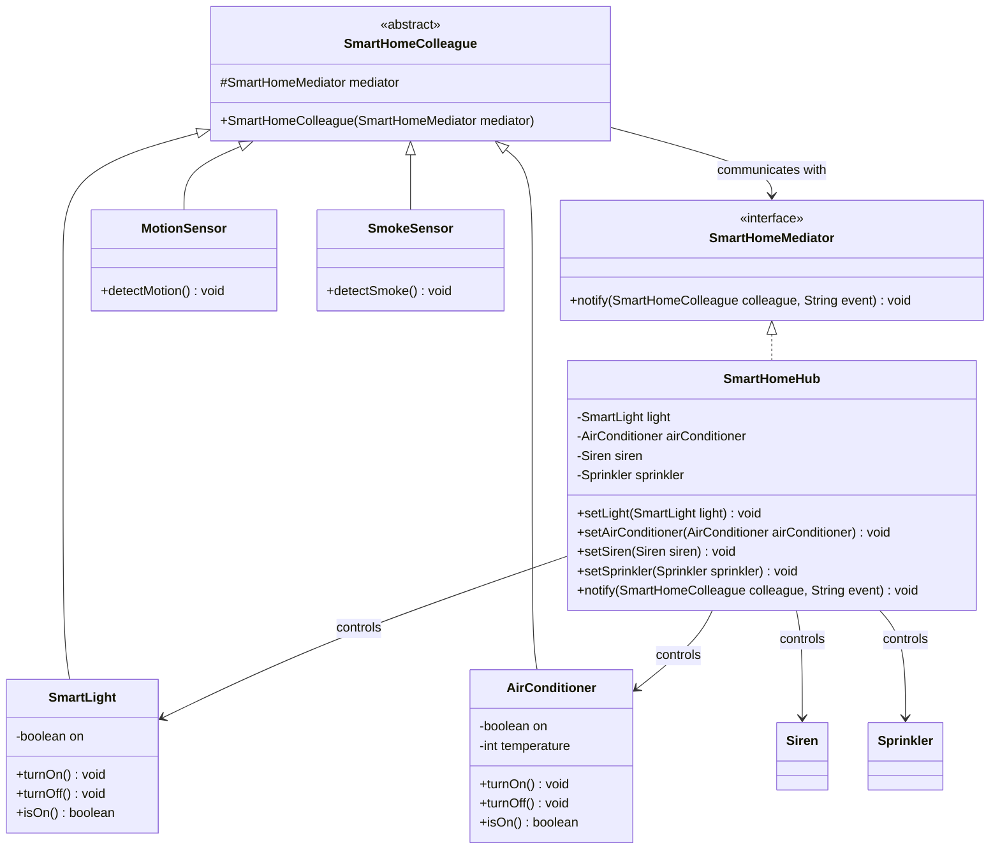

# Mediator Design Pattern (Mẫu Trung Gian)

## Overview
**Mediator** là một design pattern thuộc nhóm **Behavioral** (Hành vi). Mẫu thiết kế này định nghĩa một đối tượng điều phối trung gian đóng gói cách thức mà một tập hợp các đối tượng khác tương tác với nhau. Mediator thúc đẩy sự liên kết lỏng lẻo (loose coupling) bằng cách ngăn các đối tượng tham chiếu đến nhau một cách trực tiếp, từ đó cho phép thay đổi mối quan hệ và cách thức tương tác giữa các đối tượng một cách độc lập.

Trong Mediator Pattern, có hai thành phần chính:
1. **Mediator (Bộ trung gian)**: Định nghĩa interface để giao tiếp với các đối tượng Colleague và điều phối hành vi của toàn hệ thống.
2. **Colleague (Đồng nghiệp)**: Các lớp chức năng riêng lẻ. Chúng không giao tiếp trực tiếp với nhau mà chỉ gửi thông báo hoặc sự kiện tới Mediator.

---

## Problem

### What problem exists?
Hãy tưởng tượng chúng ta đang phát triển một hệ thống nhà thông minh (**Smart Home Automation**). Hệ thống này gồm nhiều thiết bị khác nhau:
* **Các cảm biến (Sensors)**: Cảm biến chuyển động (`MotionSensor`), cảm biến khói (`SmokeSensor`).
* **Các thiết bị chấp hành (Actuators/Devices)**: Đèn thông minh (`SmartLight`), điều hòa (`AirConditioner`), còi báo động (`Siren`), vòi phun nước (`Sprinkler`).

Các kịch bản tự động hóa trong nhà:
1. Khi phát hiện chuyển động (`motionDetected`): Đèn bật sáng, điều hòa tự động bật.
2. Khi phát hiện khói (`smokeDetected`): Còi báo động rú lên, vòi phun nước kích hoạt dập lửa, điều hòa lập tức tắt để tránh lan khói qua hệ thống thông khí, đèn bật sáng để hỗ trợ mọi người thoát hiểm.

### Why traditional implementation fails?
Nếu triển khai theo cách truyền thống (trong [behavioral/mediator/before/](file:///f:/Learning/java-design-patterns-playground/behavioral/mediator/before/)), mỗi cảm biến sẽ phải lưu giữ trực tiếp các tham chiếu và trực tiếp gọi các phương thức của các thiết bị chấp hành:

```java
// Trong SmokeSensor.java (Trước refactor)
public class SmokeSensor {
    private final Siren siren;
    private final Sprinkler sprinkler;
    private final AirConditioner airConditioner;
    private final SmartLight light;

    public void detectSmoke() {
        siren.startSounding();
        sprinkler.startWatering();
        airConditioner.turnOff();
        light.turnOn();
    }
}
```

Cách tiếp cận này gặp phải các vấn đề nghiêm trọng sau:
1. **Chặt chẽ quá mức (Tight Coupling)**: Các lớp phụ thuộc chéo lẫn nhau. `SmokeSensor` phải biết về cả 4 thiết bị khác. Mối quan hệ giao tiếp tạo thành một mạng lưới tơ nhện (Spaghetti Dependencies).
2. **Khó bảo trì và mở rộng**: Khi thêm một thiết bị mới (ví dụ: khóa cửa thông minh `SmartDoor` tự động mở khi có cháy), ta bắt buộc phải sửa mã nguồn của lớp `SmokeSensor` để truyền thêm phụ thuộc mới.
3. **Khó tái sử dụng**: Các cảm biến hoặc thiết bị chấp hành không thể tái sử dụng độc lập ở các dự án hoặc cấu hình phòng khác nhau vì chúng bị dính chặt với các đối tượng cụ thể kia.

### Which SOLID principle is violated?
* **Single Responsibility Principle (SRP)**: Lớp cảm biến (ví dụ `SmokeSensor`) vừa chịu trách nhiệm nhận diện tín hiệu vật lý từ môi trường, vừa phải đóng vai trò điều phối quy trình an toàn cứu hỏa.
* **Open/Closed Principle (OCP)**: Khi hệ thống mở rộng thêm thiết bị mới hoặc kịch bản điều khiển thay đổi, ta buộc phải chỉnh sửa trực tiếp code bên trong các cảm biến hiện có, tăng nguy cơ phát sinh lỗi ngoài ý muốn (regression bugs).

---

## Solution

Mediator giải quyết vấn đề này bằng cách đưa toàn bộ logic điều phối và giao tiếp giữa các thiết bị về một lớp trung tâm điều khiển gọi là **Mediator** (trong ví dụ là `SmartHomeHub`).
* Các thiết bị (Colleagues) không còn biết đến sự tồn tại của nhau.
* Khi có sự kiện xảy ra, cảm biến chỉ cần báo cho Mediator: `mediator.notify(this, "smokeDetected")`.
* Mediator sẽ đứng ra quyết định bật còi báo động, khởi động vòi phun, tắt điều hòa và bật đèn sáng. Các thiết bị chấp hành chỉ tập trung vào nhiệm vụ chuyên biệt của mình.

---

## UML Diagram



---

## Code Explanation

### 1. Pure Java Implementation (Sau khi cấu trúc lại)

* **Interface Trung Gian**: [SmartHomeMediator.java](file:///f:/Learning/java-design-patterns-playground/behavioral/mediator/after/SmartHomeMediator.java) định nghĩa phương thức `notify` để nhận thông báo sự kiện từ các thiết bị.
* **Lớp Đồng Nghiệp Cơ Sở**: [SmartHomeColleague.java](file:///f:/Learning/java-design-patterns-playground/behavioral/mediator/after/SmartHomeColleague.java) lưu trữ tham chiếu đến Mediator.
* **Bộ Điều Phối Trung Tâm**: [SmartHomeHub.java](file:///f:/Learning/java-design-patterns-playground/behavioral/mediator/after/SmartHomeHub.java) cài đặt interface trung gian, lưu trữ và điều phối hành vi giữa các thiết bị.
* **Cách thực thi bằng Pure Java**:
  ```java
  SmartHomeHub hub = new SmartHomeHub();
  
  // Khởi tạo các colleague liên kết với hub
  SmartLight light = new SmartLight(hub);
  AirConditioner ac = new AirConditioner(hub);
  MotionSensor motionSensor = new MotionSensor(hub);
  
  // Đăng ký các thiết bị đầu ra vào hub
  hub.setLight(light);
  hub.setAirConditioner(ac);
  
  // Kích hoạt sự kiện
  motionSensor.detectMotion(); // Hub nhận sự kiện và tự động turnOn light & ac
  ```

---

### 2. Spring Boot Implementation (Khuyên dùng cho ứng dụng Enterprise)

Trong môi trường Spring Boot, chúng ta kết hợp Mediator với **Dependency Injection** và giải quyết bài toán phụ thuộc vòng tròn (Circular Dependency) bằng cách sử dụng `@Lazy`:

* **Spring Mediator**: [SpringSmartHomeMediator.java](file:///f:/Learning/java-design-patterns-playground/behavioral/mediator/spring/SpringSmartHomeMediator.java)
* **Spring Colleague**: [SpringSmartHomeColleague.java](file:///f:/Learning/java-design-patterns-playground/behavioral/mediator/spring/SpringSmartHomeColleague.java) sử dụng `@Autowired` để tự động inject Mediator.
* **Spring SmartHome Hub**: [SpringSmartHomeHub.java](file:///f:/Learning/java-design-patterns-playground/behavioral/mediator/spring/SpringSmartHomeHub.java) được đánh dấu là `@Component` và sử dụng `@Lazy` trong tham số setter để phá vỡ vòng lặp phụ thuộc khi Spring khởi tạo các bean đồng nghiệp kế thừa từ `SpringSmartHomeColleague`.

```java
@Component
public class SpringSmartHomeHub implements SpringSmartHomeMediator {
    private SpringSmartLight light;
    private SpringAirConditioner airConditioner;
    // ...

    @Autowired
    public void registerDevices(@Lazy SpringSmartLight light,
                                @Lazy SpringAirConditioner airConditioner,
                                @Lazy SpringSiren siren,
                                @Lazy SpringSprinkler sprinkler) {
        this.light = light;
        this.airConditioner = airConditioner;
        this.siren = siren;
        this.sprinkler = sprinkler;
    }
    // ...
}
```

---

## Advantages & Disadvantages

### Advantages (Ưu điểm)
* **Giảm thiểu Coupling**: Thay vì mối quan hệ đa-đa phức tạp giữa các lớp, hệ thống chuyển về mối quan hệ một-nhiều đơn giản với trung tâm điều phối.
* **Tăng tính đóng gói (Encapsulation)**: Logic phối hợp giữa các đối tượng được tách biệt và đóng gói hoàn toàn trong lớp Mediator.
* **Dễ bảo trì và mở rộng**: Khi cần bổ sung thiết bị chấp hành mới, ta chỉ cần sửa đổi lớp Mediator mà không làm ảnh hưởng đến các cảm biến phát sự kiện (đáp ứng OCP).
* **Tái sử dụng cao**: Các lớp Colleague độc lập hơn, có thể tái sử dụng dễ dàng trong các ngữ cảnh khác.

### Disadvantages (Nhược điểm)
* **Nguy cơ trở thành God Object**: Nếu hệ thống quá lớn với hàng trăm thiết bị và kịch bản phức tạp, Mediator có thể phình to thành một lớp khổng lồ nắm giữ quá nhiều quyền hành và logic xử lý (God Object / Monolith), gây khó khăn cho việc bảo trì chính nó.
* **Khó debug**: Việc giao tiếp gián tiếp qua trung gian làm luồng chạy chương trình trở nên khó theo dõi hơn khi debug so với việc gọi trực tiếp.

---

## Use Cases (Trường hợp áp dụng)
* **Điều khiển Giao diện người dùng (UI Dialogs / Forms)**: Khi thay đổi giá trị một combobox (ví dụ: chọn quốc gia), Mediator sẽ cập nhật danh sách tỉnh thành ở combobox tiếp theo, thay đổi định dạng tiền tệ ở input khác, bật/tắt nút "Submit". Mẫu Mediator giúp các widget UI không cần tham chiếu chéo lẫn nhau.
* **Hệ thống điều phối bay (Air Traffic Control)**: Các máy bay không liên lạc trực tiếp với nhau mà trao đổi qua tháp điều khiển không lưu (Mediator) để nhận chỉ thị hạ cánh, cất cánh.
* **Enterprise Event Bus / Message Broker**: Các hệ thống Message Broker (Kafka, RabbitMQ) hoạt động như một Mediator đứng giữa các ứng dụng Producer và Consumer.
* **Spring ApplicationEventPublisher**: Một dạng Mediator tích hợp sẵn trong Spring giúp các beans phát và nghe sự kiện mà không phụ thuộc trực tiếp vào nhau.

---

## Related Patterns (Mẫu thiết kế liên quan)
* **Observer**: Hai pattern này giải quyết cùng một vấn đề giao tiếp. Trong Observer, đối tượng gửi sự kiện không cần biết ai nhận. Trong Mediator, một đối tượng trung tâm quản lý giao tiếp giữa các bên. Đôi khi, Mediator được cài đặt kết hợp với Observer (Mediator lắng nghe các Colleagues qua cơ chế Observer).
* **Facade**: Facade cung cấp một interface đơn giản hóa cho một hệ thống con (giao tiếp một chiều từ ngoài vào trong), còn Mediator điều phối sự giao tiếp đa chiều phức tạp giữa các đối tượng bên trong hệ thống con.
* **Command**: Các sự kiện hoặc yêu cầu từ Colleague gửi đến Mediator có thể được đóng gói dưới dạng các Command để thực thi một cách linh hoạt.

---

## References
* [Refactoring.guru - Mediator Pattern](https://refactoring.guru/design-patterns/mediator)
* [Design Patterns: Elements of Reusable Object-Oriented Software (GoF)]
