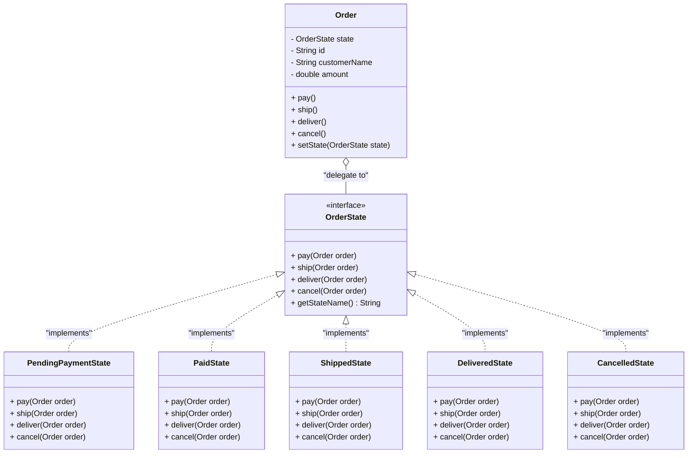

# State Pattern (Mẫu Trạng Thái)

## Overview
**State Pattern** là một design pattern thuộc nhóm **Behavioral** (Hành vi). Nó cho phép một đối tượng thay đổi hành vi của nó khi trạng thái nội bộ (internal state) của nó thay đổi. Tại thời điểm runtime, đối tượng sẽ xuất hiện giống như thể nó đã thay đổi class của chính nó.

---

## Problem
### What problem exists?
Trong một ứng dụng quản lý đơn hàng (E-commerce Order Management), một đơn hàng (`Order`) sẽ trải qua nhiều trạng thái khác nhau trong suốt vòng đời của nó:
- **Chờ thanh toán** (`Pending Payment`)
- **Đã thanh toán** (`Paid` / `Processing`)
- **Đã giao hàng** (`Shipped`)
- **Giao thành công** (`Delivered`)
- **Đã hủy** (`Cancelled`)

Tại mỗi trạng thái, các hành động như **Thanh toán** (`pay`), **Giao hàng** (`ship`), **Hoàn tất** (`deliver`), và **Hủy đơn** (`cancel`) sẽ có hành vi và quy tắc nghiệp vụ khác nhau. Ví dụ:
- Đơn hàng ở trạng thái *Chờ thanh toán* có thể thanh toán hoặc hủy, nhưng không thể giao hàng.
- Đơn hàng đã *Giao hàng* không thể hủy hoặc thanh toán lại.

### Why traditional implementation fails?
Nếu sử dụng cách tiếp cận truyền thống (trong [Order.java (before)](file:///f:/Learning/java-design-patterns-playground/behavioral/state/before/Order.java)), ta sẽ định nghĩa một Enum đại diện cho các trạng thái và dùng các khối lệnh điều kiện phức tạp (`if-else` hoặc `switch-case`) trong mỗi phương thức hành động để kiểm tra trạng thái hiện tại:

```java
public void ship() {
    switch (state) {
        case PENDING_PAYMENT -> throw new IllegalStateException("Cannot ship unpaid order.");
        case PAID -> {
            // Thực hiện giao hàng và chuyển trạng thái
            this.state = OrderState.SHIPPED;
        }
        case SHIPPED -> throw new IllegalStateException("Order is already shipped.");
        ...
    }
}
```

Cách tiếp cận này gặp các vấn đề lớn sau:
1. **Khó bảo trì và mở rộng**: Khi thêm một trạng thái mới (ví dụ: `Returned` - Đổi trả), bạn buộc phải tìm đến từng phương thức (`pay`, `ship`, `deliver`, `cancel`) và thêm nhánh logic cho trạng thái mới này.
2. **Quá nhiều trách nhiệm**: Class `Order` vừa phải giữ thông tin dữ liệu của đơn hàng, vừa phải ôm đồm tất cả logic nghiệp vụ và quy tắc chuyển đổi trạng thái của tất cả các bang khác nhau.

### Which SOLID principle is violated?
Cách làm truyền thống vi phạm trực tiếp:
- **Open/Closed Principle (OCP)**: Class `Order` không đóng đối với việc sửa đổi. Mỗi lần có thêm trạng thái hoặc thay đổi luồng chuyển trạng thái, ta đều phải sửa đổi code nguồn của `Order`.
- **Single Responsibility Principle (SRP)**: Lớp `Order` gánh quá nhiều trách nhiệm xử lý nghiệp vụ trạng thái thay vì chỉ đóng vai trò là một Context nắm giữ thông tin đơn hàng.

---

## Solution
State Pattern giải quyết triệt để vấn đề này bằng cách:
1. Trích xuất hành vi của từng trạng thái cụ thể thành các lớp riêng biệt (gọi là các **Concrete State**) implement một Interface chung (`OrderState`).
2. Class `Order` (gọi là **Context**) sẽ không tự xử lý logic kiểm tra điều kiện phức tạp nữa. Thay vào đó, nó giữ một tham chiếu tới Interface `OrderState` và ủy quyền (delegate) xử lý các hành động cho đối tượng state hiện tại của nó.
3. Khi thực hiện một hành động thành công, đối tượng state hiện tại sẽ chịu trách nhiệm thay đổi trạng thái của Context sang trạng thái mới (ví dụ: từ `PendingPaymentState` chuyển sang `PaidState`).

---

## UML Diagram



---

## Code Explanation

### 1. Pure Java Version (Mã nguồn thuần Java)

- **[OrderState.java (after)](file:///f:/Learning/java-design-patterns-playground/behavioral/state/after/OrderState.java)**: Định nghĩa interface chung. Mỗi phương thức nhận vào tham chiếu `Order` để có thể thay đổi trạng thái của nó khi chuyển đổi.
- **[PendingPaymentState.java](file:///f:/Learning/java-design-patterns-playground/behavioral/state/after/PendingPaymentState.java)**: Ở trạng thái này, nếu khách hàng gọi `pay()`, hệ thống sẽ ghi nhận thanh toán thành công và gọi `order.setState(new PaidState())` để chuyển trạng thái. Nếu gọi `ship()` hay `deliver()`, hệ thống sẽ ném ra ngoại lệ `IllegalStateException` vì đây là các hành động không hợp lệ khi chưa thanh toán.
- **[Order.java (after)](file:///f:/Learning/java-design-patterns-playground/behavioral/state/after/Order.java)** (Context): Khởi tạo mặc định trạng thái ban đầu là `new PendingPaymentState()`. Các phương thức như `pay()`, `ship()` chỉ đơn giản gọi `state.pay(this)` hoặc `state.ship(this)`.

### 2. Spring Boot Version (Tích hợp Spring Boot)

Trong môi trường Spring Boot, việc tạo mới đối tượng State liên tục thông qua từ khóa `new` tại mỗi bước chuyển đổi trạng thái có thể gây lãng phí bộ nhớ và khó khăn cho Dependency Injection (nếu các State cần gọi tới các Service khác như `EmailService`, `InventoryService`...).

Giải pháp là thiết kế **Stateless State Components**:
1. Đăng ký mỗi State là một Spring `@Component` (ví dụ: `@Component("paidState")`). Nhờ đó, các State trở thành các Singleton bean duy nhất.
2. Lớp **Context** [Order.java (spring)](file:///f:/Learning/java-design-patterns-playground/behavioral/state/spring/Order.java) không giữ trực tiếp đối tượng State, mà chỉ lưu trữ trạng thái dưới dạng chuỗi kí tự `String state` (ví dụ: `"PENDING_PAYMENT"`), tương thích hoàn hảo với việc lưu trữ cơ sở dữ liệu (JPA/Hibernate).
3. Lớp [OrderService.java](file:///f:/Learning/java-design-patterns-playground/behavioral/state/spring/OrderService.java) tự động nạp danh sách các State thông qua Autowiring:
   ```java
   @Autowired
   public OrderService(List<OrderState> states) {
       this.stateMap = states.stream()
               .collect(Collectors.toMap(OrderState::getStateName, Function.identity()));
   }
   ```
4. Khi nhận được yêu cầu xử lý một đơn hàng, `OrderService` sẽ lấy ra State Bean tương ứng từ `stateMap` bằng `order.getState()` và thực hiện ủy quyền xử lý.

---

## Advantages
- **Single Responsibility Principle (SRP)**: Gom toàn bộ logic nghiệp vụ của từng trạng thái cụ thể vào một lớp duy nhất.
- **Open/Closed Principle (OCP)**: Dễ dàng thêm trạng thái mới mà không ảnh hưởng tới lớp Context hoặc các lớp trạng thái cũ khác.
- **Loại bỏ khối lệnh rẽ nhánh phức tạp**: Thay thế các câu lệnh `if-else` / `switch-case` cồng kềnh bằng tính đa hình (polymorphism) rõ ràng, sạch sẽ.
- **Chuyển đổi trạng thái rõ ràng**: Các bước chuyển trạng thái được quy định tường minh trực tiếp bên trong các Concrete State.

## Disadvantages
- **Tăng số lượng class**: Càng nhiều trạng thái, số lượng file mã nguồn cần quản lý càng lớn.
- **Phức tạp hóa hệ thống**: Nếu đối tượng chỉ có 1-2 trạng thái đơn giản và hiếm khi thay đổi, việc áp dụng State Pattern có thể làm quá tải thiết kế hệ thống không cần thiết.

---

## Use Cases
| Pattern | Business Use Case |
|---------|-------------------|
| **State** | **Order Lifecycle** (Quản lý vòng đời đơn hàng thương mại điện tử: Chờ thanh toán -> Đang chuẩn bị -> Đang giao -> Thành công/Đã hủy). |
| **State** | **Document Approval Flow** (Luồng phê duyệt văn bản: Bản nháp -> Chờ duyệt -> Đã duyệt -> Xuất bản / Bị từ chối). |
| **State** | **Vending Machine** (Hệ thống máy bán nước tự động: Không có tiền -> Đã nhận tiền -> Đang trả nước -> Hết nước). |
| **State** | **TCP Connection** (Quản lý trạng thái kết nối mạng: Closed, Listen, Syn Sent, Established). |

---

## Related Patterns
- **Strategy**: Rất tương đồng về mặt cấu trúc (đều dựa trên Composition). Tuy nhiên, **State** thay đổi hành vi động dựa vào biến đổi trạng thái nội bộ của đối tượng tại runtime mà client không cần biết. Còn **Strategy** thường do client chủ động chọn lựa thuật toán phù hợp từ đầu.
- **Flyweight**: Thường được kết hợp với State Pattern khi các trạng thái là stateless và có thể được chia sẻ (shareable) để tránh khởi tạo dư thừa đối tượng.

---

## References
- [Refactoring.guru - State Pattern](https://refactoring.guru/design-patterns/state)
- [Head First Design Patterns (Book)]
