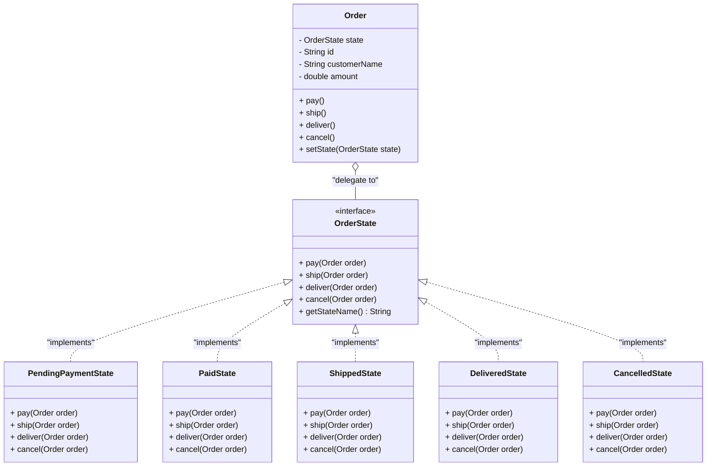

# State Pattern

## Overview
**State Pattern** is a behavioral design pattern that lets an object alter its behavior when its internal state changes. The object will appear to change its class at runtime.

---

## Problem
In an e-commerce order management system, an order (`Order`) passes through several states during its lifecycle:
- `PENDING_PAYMENT` (New order waiting for payment)
- `PAID` (Order paid successfully, preparing for shipping)
- `SHIPPED` (Package handed over to shipping provider)
- `DELIVERED` (Package successfully delivered to buyer)
- `CANCELLED` (Order cancelled)

At each state, operations like `pay()`, `ship()`, `deliver()`, and `cancel()` behave differently:
- A `PENDING_PAYMENT` order can be paid or cancelled, but cannot be shipped.
- A `SHIPPED` order cannot be cancelled or re-paid.

### Why traditional implementation fails
In a traditional approach (as seen in [Order.java (before)](file:///f:/Learning/java-design-patterns-playground/behavioral/state/before/Order.java)), order states are managed using an enum and large nested conditional blocks (`if-else` or `switch-case`) within every action method to verify the current state:

```java
public void ship() {
    switch (state) {
        case PENDING_PAYMENT -> throw new IllegalStateException("Cannot ship unpaid order.");
        case PAID -> {
            this.state = OrderState.SHIPPED;
        }
        case SHIPPED -> throw new IllegalStateException("Order is already shipped.");
        ...
    }
}
```

This traditional implementation has significant drawbacks:
1. **Difficult to Maintain and Extend**: If a new state is added (e.g., `RETURNED`), you have to modify the source code of every action method to add the new state handling.
2. **Violates Separation of Concerns**: The `Order` class is overloaded. It holds data attributes of an order and implements all business rules and transitions for every state.

### Which SOLID principles are violated?
- **Open/Closed Principle (OCP)**: The `Order` class is not closed for modification. Every new state or transition flow change requires modifying the source code of the class.
- **Single Responsibility Principle (SRP)**: The `Order` class holds both order data and state-specific business logic.

---

## Solution
The State Pattern solves these problems:
1. Extracting state-specific behaviors into separate classes (called **Concrete States**) that implement a common interface `OrderState`.
2. The `Order` class (acting as the **Context**) delegates state-specific operations to the current state object instead of checking states using conditionals.
3. When an operation succeeds, the active state object is responsible for transitioning the `Order` context to its next state (e.g. from `PendingPaymentState` to `PaidState`).

---

## UML Diagram



---

## Code Explanation

### 1. Pure Java Version
- **[OrderState.java (after)](file:///f:/Learning/java-design-patterns-playground/behavioral/state/after/OrderState.java)**: Defines the common state interface. Every method accepts an `Order` reference to allow state transitions.
- **[PendingPaymentState.java](file:///f:/Learning/java-design-patterns-playground/behavioral/state/after/PendingPaymentState.java)**: In this state, calling `pay()` processes the payment and transitions the context using `order.setState(new PaidState())`. Calling `ship()` or `deliver()` throws an `IllegalStateException`.
- **[Order.java (after)](file:///f:/Learning/java-design-patterns-playground/behavioral/state/after/Order.java)** (Context): Instantiates the initial state as `PendingPaymentState`. Action methods like `pay()` simply delegate to `state.pay(this)`.

### 2. Spring Boot Version (Stateless State Components)
In Spring Boot, instantiating new State objects using `new` for every transition can lead to resource waste and complicates Dependency Injection (e.g., if states need to autowire other Spring services).

We use **Stateless State Components**:
1. Register each state as a Spring `@Component` bean (e.g. `@Component("paidState")`), making them singletons.
2. The domain entity [Order.java (spring)](file:///f:/Learning/java-design-patterns-playground/behavioral/state/spring/Order.java) represents state as a database-friendly `String state` (e.g., `"PENDING_PAYMENT"`).
3. The [OrderService.java](file:///f:/Learning/java-design-patterns-playground/behavioral/state/spring/OrderService.java) autowires all states:
   ```java
   @Autowired
   public OrderService(List<OrderState> states) {
       this.stateMap = states.stream()
               .collect(Collectors.toMap(OrderState::getStateName, Function.identity()));
   }
   ```
4. `OrderService` queries the appropriate State bean from `stateMap` using `order.getState()` and delegates operations.

---

## Advantages
- **Single Responsibility Principle (SRP)**: Groups all state-specific business logic into a single dedicated class.
- **Open/Closed Principle (OCP)**: Easy to introduce new states or alter transition flows without modifying existing states or context code.
- **Eliminates complex conditional blocks**: Replaces nested `if-else` / `switch-case` blocks with clean polymorphism.

## Disadvantages
- **Increased Number of Classes**: Every state requires its own class.
- **Overkill for simple scenarios**: If an object transitions between only 1 or 2 simple states, applying this pattern can overcomplicate the design.

---

## Use Cases
- **Order Lifecycle Management**: Transitioning through Created -> Paid -> Shipped -> Delivered.
- **Document Approval Workflows**: Draft -> Awaiting Approval -> Approved -> Published / Rejected.
- **Vending Machine logic**: Idle -> Accept Coins -> Dispense Product -> Out of Stock.
- **TCP Connections**: Closed, Listen, Syn Sent, Established.

---

## Related Patterns
- **Strategy**: Similar UML class structure, but Strategy is configured by the client at initialization, whereas **State** changes behaviors dynamically at runtime based on the object's internal state.
- **Flyweight**: Often combined with the State pattern to share stateless state instances.

---

## References
- [Refactoring Guru - State Design Pattern](https://refactoring.guru/design-patterns/state)
