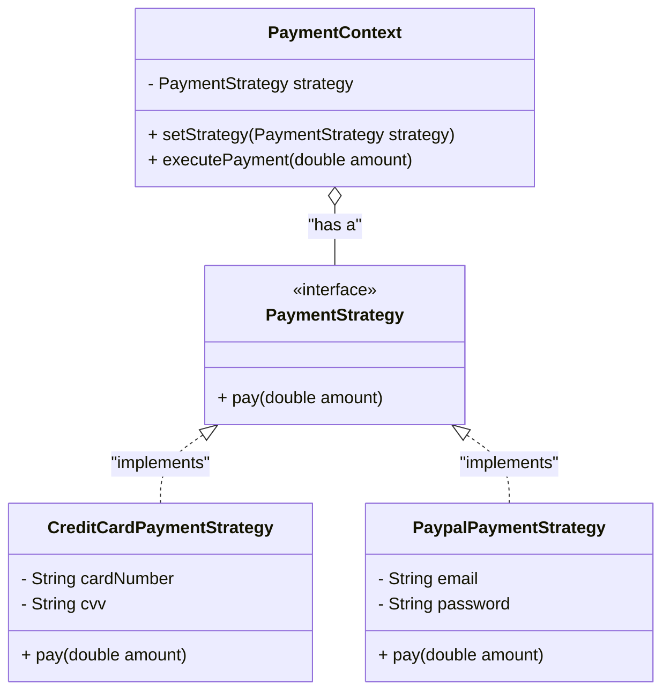

# Strategy Pattern

## Overview
**Strategy Pattern** là một design pattern thuộc nhóm **Behavioral** (Hành vi). Nó cho phép bạn định nghĩa một tập hợp các thuật toán (algorithms), đóng gói từng thuật toán lại, và làm cho chúng có thể thay thế lẫn nhau (interchangeable). Strategy giúp thuật toán có thể biến đổi độc lập với client sử dụng nó.

## Problem
### What problem exists?
Trong một ứng dụng thương mại điện tử, ban đầu hệ thống chỉ hỗ trợ thanh toán qua thẻ tín dụng (Credit Card). Sau đó, bạn được yêu cầu thêm các phương thức thanh toán mới như PayPal, Apple Pay, hoặc Crypto.

### Why traditional implementation fails?
Nếu sử dụng cách tiếp cận truyền thống, bạn thường sẽ dùng các câu lệnh `if-else` hoặc `switch-case` khổng lồ trong class `PaymentService` để kiểm tra loại thanh toán và gọi logic tương ứng. Khi số lượng phương thức thanh toán tăng lên, lớp này sẽ trở nên quá lớn, khó bảo trì, dễ sinh lỗi khi sửa đổi.

### Which SOLID principle is violated?
Cách tiếp cận truyền thống vi phạm trực tiếp **Open/Closed Principle (OCP)**. Khi cần thêm một phương thức thanh toán mới, bạn phải sửa đổi class `PaymentService` (Mở để sửa đổi - điều này là không tốt), thay vì chỉ thêm code mới (Mở để mở rộng). Nó cũng có thể vi phạm **Single Responsibility Principle (SRP)** vì `PaymentService` đang phải gánh quá nhiều logic thanh toán khác nhau.

## Solution
Strategy Pattern giải quyết vấn đề này bằng cách:
1. Trích xuất tất cả logic của các phương thức thanh toán (thuật toán) vào các class riêng biệt được gọi là **Strategies**.
2. Định nghĩa một Interface chung (`PaymentStrategy`) mà tất cả các strategies đều phải implement.
3. Class ban đầu (`PaymentContext` / `PaymentService`) thay vì tự thực thi logic, sẽ chứa một tham chiếu tới Interface `PaymentStrategy` và "ủy quyền" (delegate) việc thanh toán cho đối tượng strategy hiện tại.

## UML Diagram

## Advantages
- **Open/Closed Principle**: Dễ dàng thêm thuật toán/phương thức mới mà không làm thay đổi Context.
- **Single Responsibility Principle**: Tách biệt logic kinh doanh cốt lõi (Context) ra khỏi chi tiết triển khai của thuật toán (Strategy).
- **Tránh code lặp lặp / Câu lệnh rẽ nhánh**: Loại bỏ được các khối `if-else` phức tạp.
- **Dễ test**: Có thể mock/stub từng strategy dễ dàng trong Unit Tests.

## Disadvantages
- Client phải nhận biết được sự tồn tại của các strategies khác nhau để chọn ra strategy phù hợp.
- Tăng số lượng class trong project.
- Nếu bạn chỉ có một vài thuật toán và chúng hiếm khi thay đổi, việc sử dụng pattern này có thể gây phức tạp hóa hệ thống quá mức.

## Use Cases
| Pattern | Business Use Case |
|---------|-------------------|
| Strategy| **Payment Methods** (Thanh toán qua thẻ, Paypal, Momo...) |
| Strategy| **Routing Algorithms** (Tìm đường đi ngắn nhất: đi bộ, xe máy, ô tô...) |
| Strategy| **Sorting Algorithms** (Sắp xếp theo giá, theo tên, theo đánh giá...) |
| Strategy| **Compression Strategies** (Nén file zip, rar, tar...) |

## Related Patterns
- **State**: Khá giống Strategy về cấu trúc UML nhưng mục đích khác nhau. State thay đổi hành vi dựa trên trạng thái bên trong của nó, trong khi Strategy là do client chủ động cấu hình.
- **Command**: Encapsulate một request thành một object, có thể thực hiện queue, log, undo, nhưng Strategy tập trung vào thuật toán.
- **Decorator**: Thay đổi ngoại vi (skin) của một object, trong khi Strategy thay đổi lõi (guts) bên trong.

## References
- [Refactoring.guru - Strategy Pattern](https://refactoring.guru/design-patterns/strategy)
- [Head First Design Patterns (Book)]
