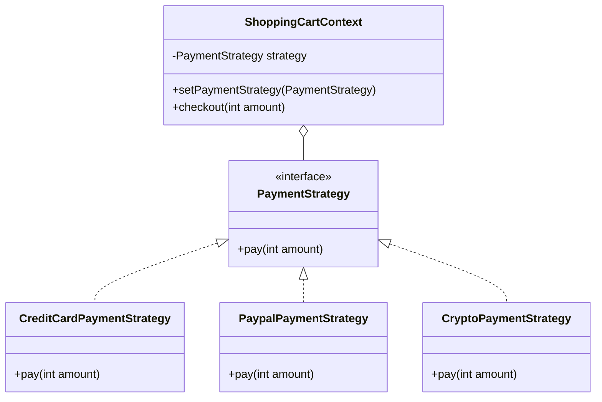

# Strategy Pattern

## Overview
**Strategy Pattern** is a behavioral design pattern that lets you define a family of algorithms, put each of them into a separate class, and make their objects interchangeable. It enables the algorithms to vary independently from clients that use them.

## Problem
In our e-commerce system, we need to process payments using different methods: Credit Card, PayPal, Crypto, etc.
Using traditional implementation (like in `OrderPaymentBefore.java`), we end up with huge `if-else` or `switch-case` statements in the order processing logic. 
Every time a new payment method is introduced, the core logic class has to be modified.

This violates:
* **Open/Closed Principle (OCP)**: The class is not closed for modification.
* **Single Responsibility Principle (SRP)**: The context class is overloaded with specific payment details instead of just handling the checkout process.

## Solution
We create a common interface `PaymentStrategy` with a `pay()` method. Specific payment methods (e.g., `CreditCardPaymentStrategy`, `PaypalPaymentStrategy`) implement this interface. The `ShoppingCartContext` class maintains a reference to a `PaymentStrategy` and delegates the payment work to it.

## UML

## Advantages
* **Open/Closed Principle**: You can introduce new strategies without changing the context.
* **Separation of Concerns**: Payment algorithms are separated from the main e-commerce logic.
* **Runtime Switching**: You can swap algorithms at runtime.
* **Testability**: It's much easier to test small, isolated strategy classes than a massive if-else block.

## Disadvantages
* **Increased Number of Classes**: It introduces several new classes/interfaces to the project.
* **Client Awareness**: The client must be aware of the different strategies to select the appropriate one.

## Use Cases
* **Payment Methods** (Our implementation).
* **Sorting Algorithms**: Switching between QuickSort, MergeSort, etc.
* **Data Compression**: ZIP vs RAR vs TAR.
* **Route Calculation**: Navigation apps calculating routes for walking, driving, or public transport.

## Related Patterns
* **State**: Can be considered an extension of Strategy. Both are based on composition. State allows the object to alter its behavior when its internal state changes (it can transition to different states). Strategy completely replaces the algorithm and usually the client provides the strategy.
* **Command**: Encapsulates a request as an object, but Command's intent is to decouple the sender from the receiver. Strategy's intent is to let you swap algorithms.

## References
* [Refactoring Guru - Strategy](https://refactoring.guru/design-patterns/strategy)
