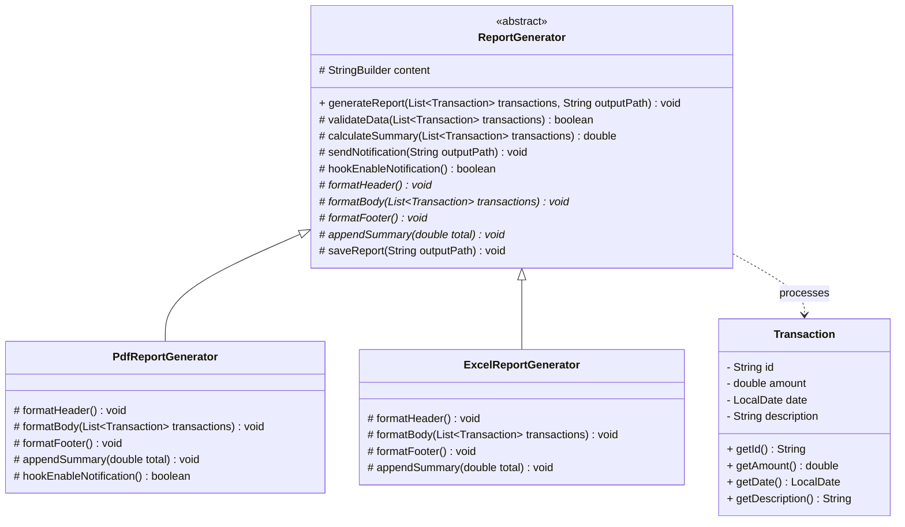

# Template Method Pattern (Mẫu Phương Thức Mẫu)

## Overview
**Template Method** là một design pattern thuộc nhóm **Behavioral** (Hành vi). Mẫu thiết kế này định nghĩa khung xương (skeleton) của một thuật toán trong lớp cha (superclass), nhưng cho phép các lớp con (subclasses) ghi đè (override) các bước cụ thể của thuật toán đó mà không làm thay đổi cấu trúc tổng thể của nó.

---

## Problem

### What problem exists?
Trong một ứng dụng tài chính hoặc quản trị doanh nghiệp, chúng ta cần xuất báo cáo (Report Generation) dưới nhiều định dạng khác nhau như PDF, Excel, CSV hoặc HTML từ dữ liệu danh sách các giao dịch (`Transaction`).

Quy trình xuất báo cáo luôn tuân theo một chuỗi các bước cố định:
1. **Kiểm tra tính hợp lệ** của dữ liệu giao dịch đầu vào.
2. **Khởi tạo dữ liệu / Header** của báo cáo.
3. **Định dạng phần thân (Body)** của báo cáo dựa trên danh sách các giao dịch.
4. **Tính toán tổng kết** (Ví dụ: tính tổng tiền, thuế, tổng số lượng giao dịch).
5. **Ghi chân trang (Footer)** của báo cáo.
6. **Lưu báo cáo** ra tệp tin ở đường dẫn định sẵn.
7. **Gửi thông báo** (nếu báo cáo thuộc dạng quan trọng, ví dụ như PDF gửi cho sếp).

### Why traditional implementation fails?
Nếu triển khai theo cách truyền thống (trong [ReportGeneratorService.java (before)](file:///f:/Learning/java-design-patterns-playground/behavioral/template_method/before/ReportGeneratorService.java)), chúng ta sẽ viết một lớp duy nhất chứa tất cả các logic kiểm tra và định dạng này thông qua các khối lệnh `if-else` hoặc `switch-case`:

```java
public void generateReport(String format, List<Transaction> transactions, String outputPath) {
    // 1. Kiểm tra dữ liệu (Trùng lặp logic)
    if (transactions == null || transactions.isEmpty()) { ... }

    if ("PDF".equalsIgnoreCase(format)) {
        // Render PDF header, body, footer, tính toán tổng, lưu file
        // Gửi thông báo
    } else if ("EXCEL".equalsIgnoreCase(format)) {
        // Render Excel cells, rows, tính toán tổng, lưu file
    }
}
```

Cách làm này gặp phải các nhược điểm lớn sau:
1. **Trùng lặp mã nguồn (Code Duplication)**: Các bước như kiểm tra tính hợp lệ dữ liệu, tính toán tổng tiền (`calculateSummary`), và lưu tệp tin (`saveReport`) bị lặp lại ở mỗi khối định dạng, mặc dù chúng hoàn toàn giống nhau về mặt thuật toán.
2. **Khó bảo trì và mở rộng**: Khi cần bổ sung thêm định dạng báo cáo mới (ví dụ: CSV, XML, HTML), ta bắt buộc phải thay đổi trực tiếp mã nguồn của lớp `ReportGeneratorService` bằng cách thêm một khối `else-if`.
3. **Thiếu linh hoạt**: Rất khó kiểm soát luồng chạy để đảm bảo rằng mọi loại báo cáo đều tuân thủ đúng thứ tự các bước xuất báo cáo tiêu chuẩn của doanh nghiệp.

### Which SOLID principle is violated?
* **Single Responsibility Principle (SRP)**: Lớp `ReportGeneratorService` vừa chịu trách nhiệm quản lý cấu trúc thuật toán xuất báo cáo chung, vừa chịu trách nhiệm triển khai định dạng chi tiết cho từng loại báo cáo cụ thể (PDF, Excel).
* **Open/Closed Principle (OCP)**: Lớp không đóng đối với việc sửa đổi. Việc thêm một định dạng báo cáo mới yêu cầu chỉnh sửa mã nguồn hiện tại, dễ gây ảnh hưởng (regression bugs) đến các định dạng đang chạy ổn định.

---

## Solution

Template Method giải quyết triệt để vấn đề này bằng cách:
1. Tạo một lớp cha trừu tượng (`ReportGenerator`) để định nghĩa thuật toán chung dưới dạng một phương thức `final` (gọi là **Template Method**). Phương thức này sẽ gọi các bước con theo một trình tự nghiêm ngặt.
2. Các bước con được phân loại thành:
   * **Abstract Steps (Các bước trừu tượng)**: Các bước có cách triển khai hoàn toàn khác nhau giữa các định dạng (ví dụ: `formatHeader`, `formatBody`, `formatFooter`, `appendSummary`), buộc các lớp con cụ thể phải tự triển khai.
   * **Default/Concrete Steps (Các bước mặc định)**: Các bước có chung logic xử lý cho tất cả các lớp con (ví dụ: `validateData`, `calculateSummary`, `saveReport`), giúp tái sử dụng mã nguồn.
   * **Hooks (Các bước móc nối)**: Các phương thức trống hoặc trả về giá trị mặc định (ví dụ: `hookEnableNotification()`), giúp các lớp con có thể can thiệp tùy chọn vào luồng thuật toán mà không bắt buộc phải viết lại.

---

## UML Diagram



---

## Code Explanation

### 1. Pure Java Implementation (Sau khi cấu trúc lại)

* **Lớp cha định nghĩa khung thuật toán**: [ReportGenerator.java](file:///f:/Learning/java-design-patterns-playground/behavioral/template_method/after/ReportGenerator.java) định nghĩa phương thức mẫu `final void generateReport(...)` và quản lý bộ đệm kết quả.
* **Lớp con triển khai báo cáo PDF**: [PdfReportGenerator.java](file:///f:/Learning/java-design-patterns-playground/behavioral/template_method/after/PdfReportGenerator.java) định dạng chi tiết PDF và kích hoạt hook gửi thông báo.
* **Lớp con triển khai báo cáo Excel**: [ExcelReportGenerator.java](file:///f:/Learning/java-design-patterns-playground/behavioral/template_method/after/ExcelReportGenerator.java) định dạng bảng biểu Excel và bỏ qua thông báo.

* **Cách thực thi bằng Pure Java**:
  ```java
  List<Transaction> data = getTransactions();
  
  ReportGenerator pdfGenerator = new PdfReportGenerator();
  pdfGenerator.generateReport(data, "output.pdf"); // Tạo PDF và gửi thông báo
  
  ReportGenerator excelGenerator = new ExcelReportGenerator();
  excelGenerator.generateReport(data, "output.csv"); // Tạo Excel không gửi thông báo
  ```

---

### 2. Spring Boot Implementation (Khuyên dùng cho ứng dụng Enterprise)

Trong môi trường Spring Boot, chúng ta kết hợp Template Method với **Dependency Injection** để quản lý các Report Generator tự động:

* **Lớp cơ sở trừu tượng**: [ReportGenerator.java](file:///f:/Learning/java-design-patterns-playground/behavioral/template_method/spring/ReportGenerator.java) bổ sung thêm phương thức `getFormatType()` để xác định định dạng.
* **Định nghĩa các Spring Component**:
  * [PdfReportGenerator.java](file:///f:/Learning/java-design-patterns-playground/behavioral/template_method/spring/PdfReportGenerator.java) được đánh dấu `@Component`.
  * [ExcelReportGenerator.java](file:///f:/Learning/java-design-patterns-playground/behavioral/template_method/spring/ExcelReportGenerator.java) được đánh dấu `@Component`.
* **Quản lý tập trung**: [ReportExportService.java](file:///f:/Learning/java-design-patterns-playground/behavioral/template_method/spring/ReportExportService.java) tự động nhận danh sách tất cả các Generator được đăng ký trong Spring Context và lập bản đồ định tuyến ở runtime:
  ```java
  @Service
  public class ReportExportService {
      private final Map<String, ReportGenerator> generatorMap;
  
      @Autowired
      public ReportExportService(List<ReportGenerator> generators) {
          this.generatorMap = generators.stream()
                  .collect(Collectors.toMap(g -> g.getFormatType().toUpperCase(), Function.identity()));
      }
  
      public void exportReport(String format, List<Transaction> data, String path) throws IOException {
          ReportGenerator generator = generatorMap.get(format.toUpperCase());
          if (generator != null) {
              generator.generateReport(data, path);
          }
      }
  }
  ```

---

## Advantages & Disadvantages

### Advantages (Ưu điểm)
* **Tái sử dụng mã nguồn tối đa**: Logic chung được đưa lên lớp cha, tránh việc sao chép mã nguồn lặp đi lặp lại ở nhiều nơi.
* **Kiểm soát chặt chẽ quy trình**: Lớp cha cố định cấu trúc thuật toán bằng từ khóa `final`, đảm bảo lớp con không thể làm sai trình tự thực thi tiêu chuẩn.
* **Dễ dàng mở rộng**: Khi có thêm một định dạng báo cáo mới, ta chỉ cần tạo một lớp con mới kế thừa từ `ReportGenerator` mà không cần đụng vào các mã nguồn cũ (đáp ứng OCP).
* **Cung cấp Hook**: Giúp lớp con can thiệp vào luồng xử lý chính tại các vị trí mong muốn một cách linh hoạt.

### Disadvantages (Nhược điểm)
* **Giới hạn cấu trúc thuật toán**: Lớp con bị bó buộc bởi khung thuật toán lớp cha đã định ra. Nếu thuật toán thay đổi căn bản, việc kế thừa có thể trở nên khiên cưỡng.
* **Vi phạm Liskov Substitution Principle (LSP) nếu ghi đè sai**: Nếu một bước trừu tượng ở lớp con bị ghi đè bằng cách ném ra ngoại lệ `UnsupportedOperationException`, nó sẽ phá vỡ tính đúng đắn của phương thức mẫu ở lớp cha.
* **Khó bảo trì khi thuật toán cha quá phức tạp**: Càng nhiều bước trừu tượng và hook được định nghĩa ở lớp cha, lớp con càng trở nên phức tạp và khó cài đặt.

---

## Use Cases (Trường hợp áp dụng)
* **Quy trình xử lý tài liệu / Xuất báo cáo**: PDF, Excel, Word, CSV, HTML.
* **CI/CD Build Pipelines**: Định nghĩa các bước chung (Checkout -> Compile -> Test -> Package -> Deploy), các nền tảng hoặc ngôn ngữ khác nhau có thể override các bước Compile và Package tương ứng.
* **Quy trình kết nối dữ liệu (ETL)**: Extract (Trích xuất) -> Transform (Biến đổi) -> Load (Tải dữ liệu). Các nguồn dữ liệu khác nhau (Database, CSV File, XML API) có cách Extract và Load khác nhau nhưng Transform chung.
* **Framework Lifecycles**: Trong các Web Framework (như Spring MVC Interceptors hay Servlet lifecycle `init()`, `service()`, `destroy()`).

---

## Related Patterns (Mẫu thiết kế liên quan)
* **Factory Method**: Factory Method thường được gọi ngay bên trong một phương thức mẫu (Template Method) để khởi tạo các đối tượng phụ thuộc phục vụ thuật toán.
* **Strategy**: Cả hai đều đóng gói các thuật toán, nhưng Strategy hoạt động bằng cơ chế **Ủy quyền/Kết hợp (Composition)** ở mức đối tượng (runtime), còn Template Method hoạt động bằng cơ chế **Kế thừa (Inheritance)** ở mức lớp (compile time).
* **Builder**: Builder tập trung vào việc tạo ra các đối tượng phức tạp theo từng bước, còn Template Method tập trung vào các bước thực thi hành vi hoặc thuật toán.

---

## References
* [Refactoring.guru - Template Method Pattern](https://refactoring.guru/design-patterns/template-method)
* [Head First Design Patterns (Book)]
