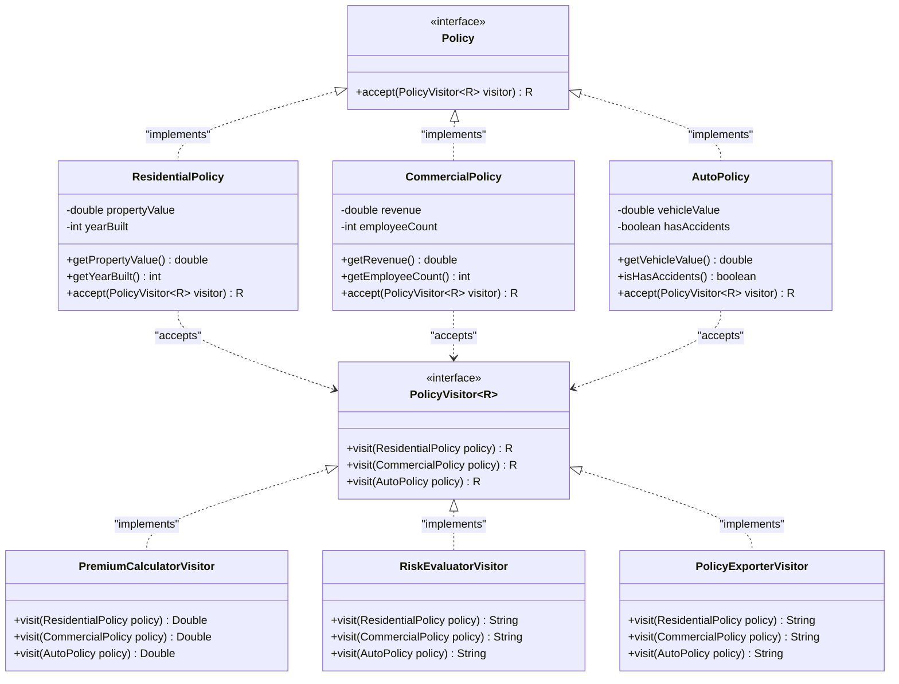

# Visitor Pattern

## Overview
**Visitor Pattern** là một design pattern thuộc nhóm **Behavioral** (Hành vi). Nó cho phép bạn tách biệt các thuật toán, thao tác hoặc hành vi xử lý ra khỏi cấu trúc đối tượng (object structure) mà chúng hoạt động trên đó. 

Nhờ vậy, bạn có thể thêm các hành vi mới vào cấu trúc đối tượng hiện có mà **không cần sửa đổi** code của các lớp trong cấu trúc đó. Điều này đạt được thông qua kỹ thuật **Double Dispatch** (gửi đi hai lần).

---

## Problem
### What problem exists?
Trong một ứng dụng quản lý bảo hiểm, chúng ta có nhiều loại hợp đồng bảo hiểm khác nhau (`Policy`):
* `ResidentialPolicy` (Hợp đồng bảo hiểm nhà dân dụng)
* `CommercialPolicy` (Hợp đồng bảo hiểm doanh nghiệp)
* `AutoPolicy` (Hợp đồng bảo hiểm xe ô tô)

Chúng ta cần thực hiện nhiều nghiệp vụ trên các hợp đồng này như:
1. Tính phí bảo hiểm định kỳ (`calculatePremium`).
2. Đánh giá mức độ rủi ro (`evaluateRisk`).
3. Xuất thông tin hợp đồng sang định dạng JSON (`exportToJson`).

### Why traditional implementation fails?
Cách tiếp cận truyền thống thường gặp hai lỗi thiết kế sau:

* **Cách 1: Thêm trực tiếp các phương thức nghiệp vụ vào interface `Policy` và các concrete class.**
  Mỗi khi có nghiệp vụ mới phát sinh (ví dụ: kiểm toán hợp đồng `auditPolicy`, xuất định dạng XML `exportToXml`), chúng ta buộc phải sửa đổi interface `Policy` và tất cả các lớp triển khai nó (`ResidentialPolicy`, `CommercialPolicy`, `AutoPolicy`). Điều này cực kỳ nguy hiểm trong các dự án lớn vì nó có thể phá vỡ tính ổn định của mã nguồn cũ.
  
* **Cách 2: Sử dụng kiểm tra kiểu dữ liệu (`instanceof` hoặc `switch-case` trên type) trong các lớp Service.**
  Ta gom hết logic xử lý vào một lớp Service và dùng `instanceof` để phân tách logic. Việc này dẫn đến cấu trúc code chứa nhiều rẽ nhánh điều kiện rườm rà. Quan trọng hơn, nếu ta thêm một loại hợp đồng mới (ví dụ: `HealthPolicy`), trình biên dịch **sẽ không cảnh báo** nếu ta quên bổ sung nhánh kiểm tra `instanceof HealthPolicy` trong các phương thức Service, dẫn đến lỗi runtime nghiêm trọng.

### Which SOLID principle is violated?
* **Open/Closed Principle (OCP)**: Lớp Service hoặc các lớp Policy phải liên tục bị mở ra để sửa đổi mỗi khi thêm nghiệp vụ mới hoặc thêm loại hợp đồng mới.
* **Single Responsibility Principle (SRP)**: Các lớp Policy (lớp dữ liệu) bị gánh thêm trách nhiệm về định dạng xuất dữ liệu (JSON/XML) hay nghiệp vụ tính toán phí vốn thuộc về phần Service logic.

---

## Solution
Visitor Pattern giải quyết triệt để các vấn đề trên bằng cách sử dụng kỹ thuật **Double Dispatch**:

1. **Định nghĩa interface Visitor (`PolicyVisitor<R>`)**:
   Chứa các phương thức overload `visit(...)` cho từng loại đối tượng cụ thể (`ResidentialPolicy`, `CommercialPolicy`, `AutoPolicy`). Sử dụng Generic `<R>` để kiểu hóa kiểu dữ liệu trả về của thao tác một cách an toàn (Type-safe).
2. **Định nghĩa phương thức `accept` trong interface `Policy`**:
   Mọi đối tượng thuộc cấu trúc dữ liệu sẽ triển khai phương thức `accept(PolicyVisitor<R> visitor)`.
3. **Double Dispatch hoạt động thế nào?**
   * **Dispatch lần 1**: Client gọi `policy.accept(visitor)`. Tại runtime, JVM sẽ quyết định phương thức `accept` của lớp con nào được chạy nhờ tính đa hình (Dynamic Polymorphism).
   * **Dispatch lần 2**: Bên trong phương thức `accept` của lớp con, nó gọi ngược lại visitor thông qua `visitor.visit(this)`. Tại đây, từ khóa `this` có kiểu dữ liệu tĩnh cụ thể (ví dụ: `ResidentialPolicy`). JVM sẽ overload đúng phương thức `visit(ResidentialPolicy)` tại thời điểm biên dịch (Static Binding).
   
Nhờ vậy, ta đã tách hoàn toàn các thuật toán ra khỏi cấu trúc dữ liệu của hợp đồng bảo hiểm.

---

## UML Diagram



---

## Advantages
* **Đảm bảo Open/Closed Principle (OCP)**: Dễ dàng thêm các thao tác mới (ví dụ: `XmlExportVisitor`) bằng cách viết một class Visitor mới mà không cần chỉnh sửa bất kỳ class Policy hiện có nào.
* **Đảm bảo Single Responsibility Principle (SRP)**: Gom các phiên bản thuật toán/logic khác nhau vào trong một class Visitor duy nhất, giải phóng các lớp Policy khỏi các logic nghiệp vụ ngoài lề.
* **Tập hợp hoạt động tốt trên các lớp không đồng nhất**: Khác với Iterator chỉ duyệt qua các phần tử có cùng kiểu chung, Visitor có thể thực hiện thao tác trên các đối tượng có cấu trúc thuộc tính hoàn toàn khác nhau.
* **Tính an toàn kiểu dữ liệu (Type Safety)**: Trình biên dịch sẽ bắt lỗi ngay nếu một Visitor không triển khai đủ phương thức `visit` cho tất cả các lớp trong hệ thống phân cấp.

## Disadvantages
* **Khó khăn khi thêm class mới vào cấu trúc dữ liệu**: Nếu thêm một lớp `HealthPolicy` vào hệ thống, ta bắt buộc phải chỉnh sửa interface `PolicyVisitor` và cập nhật tất cả các concrete visitor đã tồn tại. Do đó, Visitor chỉ phù hợp khi cấu trúc phân cấp đối tượng **ít thay đổi** nhưng hành vi nghiệp vụ **thay đổi thường xuyên**.
* **Vi phạm tính Encapsulation (Đóng gói)**: Để visitor thực hiện được logic tính toán, các concrete class (như `ResidentialPolicy`) phải cung cấp các phương thức `getter` công khai, làm lộ thông tin nội bộ của chúng ra ngoài.

---

## Use Cases
| Pattern | Business Use Case |
|---------|-------------------|
| **Visitor** | **Hệ thống bảo hiểm/tài chính**: Thực hiện nhiều loại tính toán phức tạp (tính phí, tính thuế, đánh giá điểm rủi ro, kiểm toán) trên các gói bảo hiểm hoặc danh mục tài sản đa dạng. |
| **Visitor** | **Trình biên dịch / Phân tích cú pháp (Compiler/AST)**: Duyệt cây cú pháp trừu tượng (Abstract Syntax Tree) để thực hiện kiểm tra kiểu (Type checking), tối ưu hóa mã nguồn, hoặc sinh mã máy (Code generation). |
| **Visitor** | **Xuất bản và Định dạng tài liệu**: Duyệt qua một tài liệu gồm nhiều phần tử (`Paragraph`, `Table`, `Image`) để kết xuất (render) ra HTML, PDF, Markdown hoặc đếm số từ. |

---

## Modern Alternative: Java 21 Pattern Matching for switch
Từ Java 21, tính năng **Pattern Matching for switch** kết hợp với **Sealed Classes** cung cấp một giải pháp thay thế rất mạnh mẽ cho Visitor Pattern mà không cần kỹ thuật Double Dispatch phức tạp.

Ví dụ cách viết với Java 21:
```java
public sealed interface Policy permits ResidentialPolicy, CommercialPolicy, AutoPolicy {}

public class InsuranceService {
    public double calculatePremium(Policy policy) {
        return switch (policy) {
            case ResidentialPolicy rp -> rp.getPropertyValue() * 0.005 * (rp.getYearBuilt() > 2010 ? 0.9 : 1.0);
            case CommercialPolicy cp  -> cp.getRevenue() * 0.02 + cp.getEmployeeCount() * 100.0;
            case AutoPolicy ap        -> ap.getVehicleValue() * 0.03 + (ap.isHasAccidents() ? 500.0 : 0.0);
        }; // Compiler sẽ bắt lỗi nếu thiếu bất kỳ nhánh nào nhờ tính chất Sealed Classes!
    }
}
```
* **Khi nào nên chọn Visitor Pattern?** Khi bạn muốn đóng gói trạng thái của thuật toán ngay trong Visitor (ví dụ: gom cụm logic và cấu hình nghiệp vụ trong các component Spring độc lập), hoặc làm việc trên các phiên bản Java cũ hơn (< Java 21).
* **Khi nào nên chọn Pattern Matching?** Khi bạn phát triển ứng dụng trên Java 21+ và muốn code ngắn gọn, trực quan, không cần tạo thêm nhiều interface/class Visitor rườm rà.

---

## Related Patterns
* **Composite**: Visitor thường được kết hợp để duyệt qua và thực thi các thao tác trên các nút của một cấu trúc cây Composite.
* **Double Dispatch**: Kỹ thuật cốt lõi giúp Visitor hoạt động, cho phép overload phương thức dựa trên kiểu runtime của cả bên nhận cuộc gọi và bên tham số truyền vào.

---

## References
* [Refactoring.guru - Visitor Pattern](https://refactoring.guru/design-patterns/visitor)
* [Design Patterns: Elements of Reusable Object-Oriented Software (GoF Book)]
* [Java 21 Pattern Matching for switch (Oracle Documentation)]
