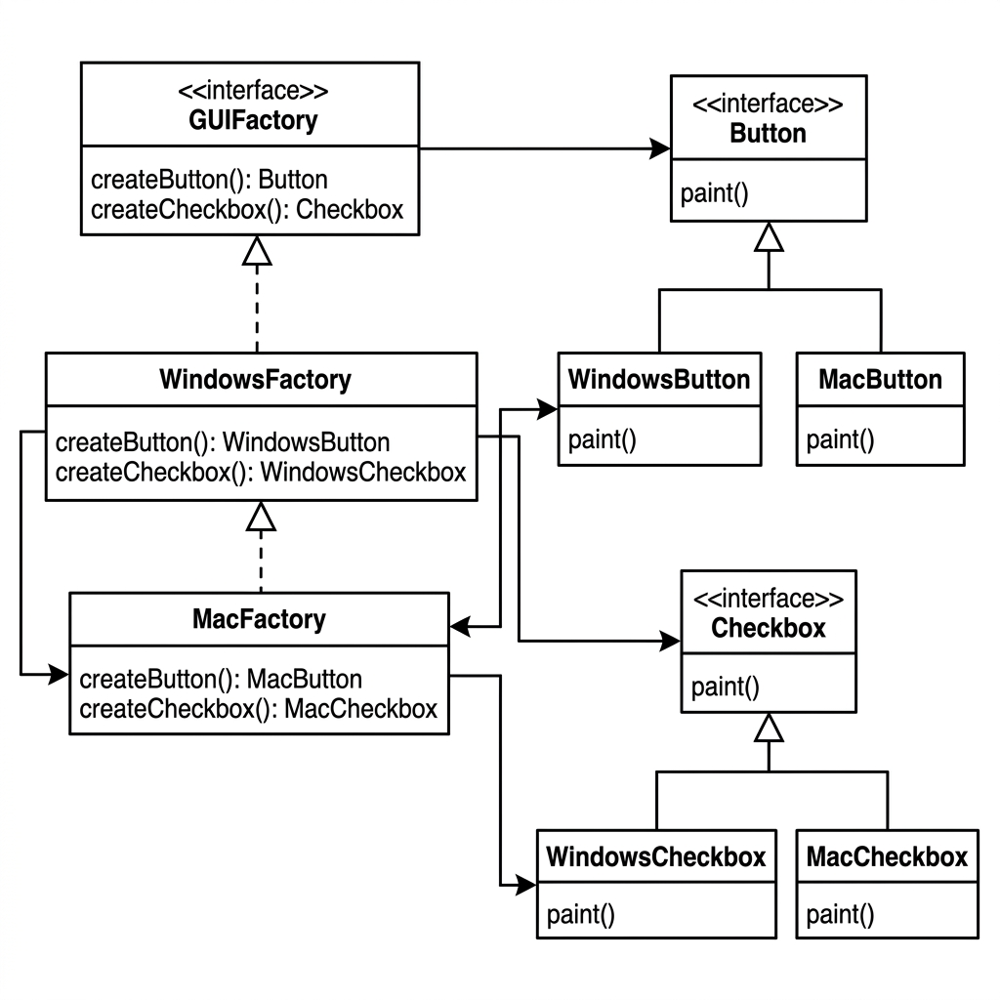
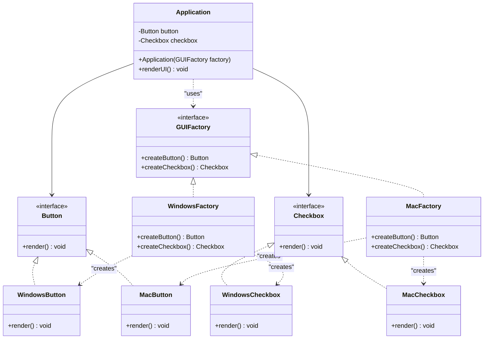

# Abstract Factory Pattern (Mẫu Nhà Máy Trừu Tượng)

## 📌 Overview (Tổng quan)

**Abstract Factory** là một Creational Design Pattern cung cấp một interface để tạo các họ đối tượng (families of related or dependent objects) liên quan hoặc phụ thuộc lẫn nhau mà không chỉ định các class cụ thể của chúng.

Nói một cách đơn giản, Abstract Factory đóng vai trò như một **"Nhà máy của các nhà máy"**. Nó định nghĩa một giao diện chung để tạo ra các sản phẩm khác nhau, nhưng việc khởi tạo cụ thể các sản phẩm đó sẽ được giao cho các lớp nhà máy con thực thi.

---

## ⚠️ Problem (Vấn đề đặt ra)

Hãy tưởng tượng bạn đang phát triển một **Cross-Platform UI Framework** (Thư viện giao diện đa nền tảng). Ứng dụng của bạn cần chạy trên nhiều hệ điều hành khác nhau, chẳng hạn như **Windows** và **macOS**. 

Đối với mỗi hệ điều hành, giao diện hiển thị của các thành phần UI như **Button** (Nút bấm) và **Checkbox** (Hộp kiểm) phải tuân theo phong cách thiết kế đặc trưng của hệ điều hành đó (Windows Style hoặc macOS Style).

### Tại sao triển khai thông thường lại thất bại (Vi phạm nguyên tắc SOLID)?

Nếu làm theo cách thông thường, tại lớp client (`Application`), mỗi khi muốn tạo Button hoặc Checkbox, chúng ta sẽ viết code kiểm tra điều kiện hệ điều hành bằng `if-else` hoặc `switch-case` rồi khởi tạo trực tiếp:

```java
public void renderUI() {
    if ("Windows".equalsIgnoreCase(osType)) {
        WindowsButton button = new WindowsButton();
        WindowsCheckbox checkbox = new WindowsCheckbox();
        button.render();
        checkbox.render();
    } else if ("Mac".equalsIgnoreCase(osType)) {
        MacButton button = new MacButton();
        MacCheckbox checkbox = new MacCheckbox();
        button.render();
        checkbox.render();
    }
}
```

Thiết kế này gặp phải các vấn đề nghiêm trọng sau:
1. **Vi phạm Single Responsibility Principle (SRP - Nguyên tắc đơn nhiệm)**: Lớp client vừa phải thực hiện các tác vụ nghiệp vụ chính, vừa phải gánh vác trách nhiệm quản lý cấu hình hệ điều hành và khởi tạo trực tiếp các đối tượng giao diện tương ứng.
2. **Vi phạm Open/Closed Principle (OCP - Nguyên tắc Mở/Đóng)**: Khi hệ thống cần hỗ trợ thêm một hệ điều hành mới (ví dụ: Linux, Android), chúng ta buộc phải sửa đổi trực tiếp code logic của lớp client. Điều này cực kỳ rủi ro và dễ phát sinh lỗi (regressions).
3. **Độ kết hợp cao (High Coupling)**: Lớp client liên kết chặt chẽ với các lớp cụ thể (`WindowsButton`, `MacCheckbox`, v.v.). Khi các lớp này thay đổi tên hoặc cách khởi tạo, lớp client cũng bị ảnh hưởng.
4. **Không đảm bảo tính nhất quán (Consistency)**: Không có cơ chế ràng buộc nào ngăn cản việc một client vô tình tạo ra một `WindowsButton` đi kèm với một `MacCheckbox` trên cùng một màn hình hiển thị, dẫn đến lỗi giao diện không đồng nhất.

---

## ❌ Before Refactoring (Thiết kế tồi)

Trước khi refactor, ứng dụng khởi tạo trực tiếp các lớp nghiệp vụ tương ứng và gọi các phương thức không đồng nhất.

* Mã nguồn chi tiết:
  - Lớp Windows Button: [WindowsButton.java (Before)](../before/WindowsButton.java)
  - Lớp Windows Checkbox: [WindowsCheckbox.java (Before)](../before/WindowsCheckbox.java)
  - Lớp macOS Button: [MacButton.java (Before)](../before/MacButton.java)
  - Lớp macOS Checkbox: [MacCheckbox.java (Before)](../before/MacCheckbox.java)
  - Lớp Client điều phối: [Application.java (Before)](../before/Application.java)

### Nhược điểm thiết kế cũ:
- Rất khó mở rộng: Khi có thêm OS mới, bắt buộc phải vào sửa code logic của client.
- Thiếu tính nhất quán: Không kiểm soát được việc phối hợp sai lệch giữa các họ đối tượng (ví dụ: nút Windows đi kèm hộp kiểm macOS).

---

## ✔️ Pattern Solution (Giải pháp Abstract Factory)

Để giải quyết triệt để vấn đề trên, chúng ta áp dụng **Abstract Factory**:
1. Định nghĩa các interface trừu tượng cho từng dòng sản phẩm: [Button.java](../after/Button.java) và [Checkbox.java](../after/Checkbox.java) (Abstract Products).
2. Tạo các lớp hiện thực hóa cụ thể cho từng hệ điều hành:
   - Hệ Windows: [WindowsButton.java](../after/WindowsButton.java), [WindowsCheckbox.java](../after/WindowsCheckbox.java)
   - Hệ macOS: [MacButton.java](../after/MacButton.java), [MacCheckbox.java](../after/MacCheckbox.java)
3. Định nghĩa interface nhà máy trừu tượng [GUIFactory.java](../after/GUIFactory.java) (Abstract Factory) quy định các phương thức tạo ra Button và Checkbox.
4. Hiện thực hóa các nhà máy cụ thể cho từng hệ điều hành:
   - [WindowsFactory.java](../after/WindowsFactory.java) chuyên tạo ra các sản phẩm Windows.
   - [MacFactory.java](../after/MacFactory.java) chuyên tạo ra các sản phẩm macOS.
5. Lớp Client [Application.java](../after/Application.java) sẽ chỉ giao tiếp với các interface trừu tượng (`GUIFactory`, `Button`, `Checkbox`) thông qua cơ chế Dependency Injection (truyền nhà máy qua constructor). Client hoàn toàn độc lập với việc đối tượng nào đang thực sự được tạo ra dưới runtime.

* Mã nguồn chi tiết:
  - **Abstract Products**:
    - [Button.java](../after/Button.java)
    - [Checkbox.java](../after/Checkbox.java)
  - **Concrete Products (Windows)**:
    - [WindowsButton.java](../after/WindowsButton.java)
    - [WindowsCheckbox.java](../after/WindowsCheckbox.java)
  - **Concrete Products (macOS)**:
    - [MacButton.java](../after/MacButton.java)
    - [MacCheckbox.java](../after/MacCheckbox.java)
  - **Abstract Factory**:
    - [GUIFactory.java](../after/GUIFactory.java)
  - **Concrete Factories**:
    - [WindowsFactory.java](../after/WindowsFactory.java)
    - [MacFactory.java](../after/MacFactory.java)
  - **Client Class**:
    - [Application.java](../after/Application.java)

---

## 📊 Diagrams (Sơ đồ lớp UML)

Dưới đây là sơ đồ lớp UML mô tả cấu trúc của Abstract Factory Pattern áp dụng cho hệ thống Cross-Platform UI:



---

### Sơ đồ lớp UML dạng Mermaid (Mermaid Class Diagram)



---

## ⚖️ Advantages & Disadvantages (Ưu & Nhược điểm)

### Ưu điểm:
* **Tính nhất quán (Product Consistency)**: Đảm bảo các sản phẩm bạn nhận được từ một nhà máy luôn tương thích và đồng bộ với nhau (tránh lỗi cắm cằm bà này vào tai bà kia).
* **Khớp nối lỏng (Loose Coupling)**: Client không cần biết về các lớp sản phẩm cụ thể. Nó chỉ giao tiếp với các interface giúp dễ bảo trì và mở rộng.
* **Tuân thủ Single Responsibility Principle (SRP)**: Tách biệt code khởi tạo đối tượng khỏi mã nguồn xử lý nghiệp vụ chính của Client.
* **Tuân thủ Open/Closed Principle (OCP)**: Dễ dàng giới thiệu thêm các nhà máy mới và họ sản phẩm mới mà không làm hỏng hay phải chỉnh sửa code client hiện tại.

### Nhược điểm:
* **Tăng độ phức tạp của mã nguồn**: Số lượng interface và class tăng lên đáng kể (mỗi khi thêm 1 dòng sản phẩm hoặc 1 hệ điều hành mới, số lượng file tăng rất nhanh).
* **Khó mở rộng thêm loại sản phẩm mới**: Nếu muốn thêm một sản phẩm trừu tượng mới (ví dụ: `TextBox`), chúng ta phải cập nhật lại interface `GUIFactory` cũng như tất cả các lớp `ConcreteFactory` hiện tại để hỗ trợ phương thức tạo sản phẩm mới.

---

## 💼 Real-world Use Case (Ứng dụng thực tế)

Trong phát triển phần mềm doanh nghiệp, Abstract Factory được ứng dụng rất nhiều:
- **Java AWT / Swing**: Lớp `Toolkit` hoạt động như một Abstract Factory để tạo các thành phần giao diện đồ họa cụ thể của từng hệ điều hành làm nền tảng bên dưới.
- **Database Access Libraries (ADO.NET, JDBC)**: Tạo các họ đối tượng kết nối cơ sở dữ liệu (`Connection`, `Command`, `Transaction`) tương ứng với từng hệ quản trị cơ sở dữ liệu (MySQL, PostgreSQL, Oracle).
- **Document Exporting Engine**: Một hệ thống xuất bản tài liệu có thể cấu hình nhà máy để tạo ra các nhóm file (PDF, Word, HTML) theo định dạng doanh nghiệp (Corporate Style) hoặc học thuật (Academic Style).

---

## 🔗 Related Patterns (Mẫu thiết kế liên quan)

- **Factory Method**: Abstract Factory thường được xây dựng trên một tập hợp các Factory Method.
- **Builder**: Abstract Factory tập trung vào việc tạo các họ đối tượng liên quan (ngay lập tức), trong khi Builder tập trung vào việc xây dựng một đối tượng phức tạp qua từng bước.
- **Singleton**: Các lớp Concrete Factory thường được triển khai dưới dạng Singleton vì chúng ta chỉ cần một thực thể duy nhất cho mỗi loại nhà máy trong hệ thống.
