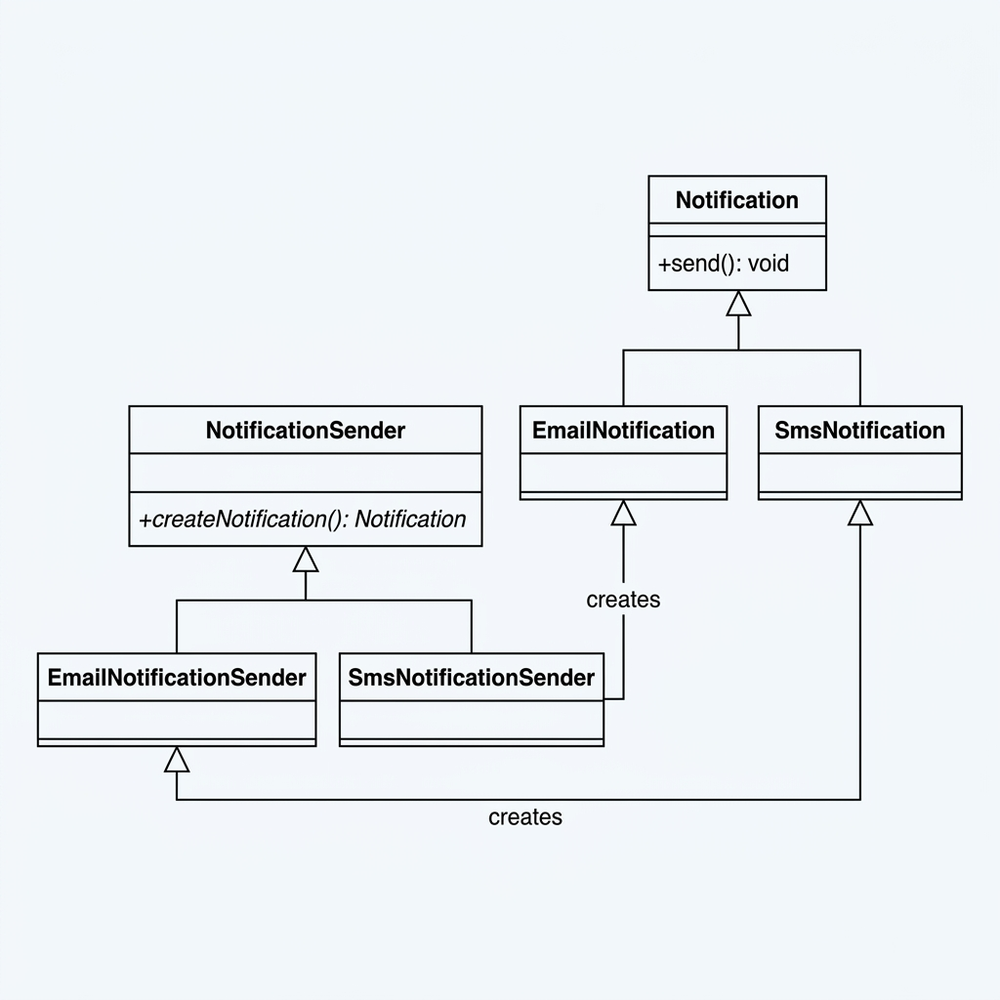
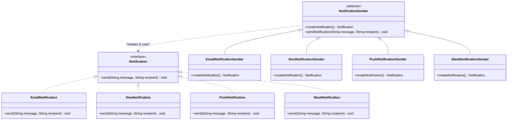

# Factory Method Pattern (Mẫu Phương Thức Nhà Máy)

## 📌 Overview (Tổng quan)

**Factory Method** là một Creational Design Pattern định nghĩa một interface (hoặc abstract class) để tạo đối tượng, nhưng để các subclass (lớp con) quyết định đối tượng của lớp nào sẽ được khởi tạo. Factory Method giúp một lớp trì hoãn việc khởi tạo đối tượng cho các lớp con.

Nói một cách đơn giản, thay vì trực tiếp sử dụng từ khóa `new` để tạo đối tượng trong lớp xử lý nghiệp vụ, ta sẽ định nghĩa một **phương thức trừu tượng** chuyên phụ trách việc tạo đối tượng đó và ủy nhiệm việc hiện thực hóa cho các lớp con.

---

## ⚠️ Problem (Vấn đề đặt ra)

Hãy tưởng tượng bạn đang xây dựng một **Hệ thống gửi thông báo (Notification Service)** cho một nền tảng thương mại điện tử. Ban đầu, hệ thống chỉ hỗ trợ gửi thông báo qua **Email**. Do đó, toàn bộ logic gửi email được tích hợp trực tiếp vào lớp xử lý chính của ứng dụng.

Sau một thời gian, khách hàng yêu cầu thêm tính năng gửi thông báo qua **SMS** và **Push Notification** trên di động. 

### Tại sao triển khai thông thường lại thất bại (Vi phạm nguyên tắc SOLID)?

Nếu làm theo cách thông thường, chúng ta sẽ viết một lớp `NotificationService` chứa các câu điều kiện `if-else` hoặc `switch-case` để kiểm tra loại thông báo cần gửi và tiến hành khởi tạo trực tiếp lớp tương ứng:

```java
public void sendNotification(String type, String message, String recipient) {
    if ("EMAIL".equalsIgnoreCase(type)) {
        EmailNotification email = new EmailNotification();
        email.sendEmail(message, recipient);
    } else if ("SMS".equalsIgnoreCase(type)) {
        SmsNotification sms = new SmsNotification();
        sms.sendSms(message, recipient);
    } ...
}
```

Thiết kế này gặp phải các vấn đề nghiêm trọng sau:
1. **Vi phạm Single Responsibility Principle (SRP - Nguyên tắc đơn nhiệm)**: Lớp dịch vụ vừa phải chịu trách nhiệm điều phối dòng nghiệp vụ gửi tin, vừa phải nắm giữ chi tiết khởi tạo và cấu hình của từng loại dịch vụ thông báo cụ thể.
2. **Vi phạm Open/Closed Principle (OCP - Nguyên tắc Mở/Đóng)**: Mỗi lần muốn thêm một kênh thông báo mới (ví dụ: Slack, Telegram), ta bắt buộc phải chỉnh sửa mã nguồn của `NotificationService`. Điều này rất dễ dẫn đến lỗi (regressions) ở các phần code đang hoạt động ổn định.
3. **Độ kết hợp cao (High Coupling)**: Lớp dịch vụ phụ thuộc trực tiếp vào các implementation cụ thể (`EmailNotification`, `SmsNotification`, v.v.), làm giảm tính linh hoạt và khả năng viết Unit Test (khó Mock).

---

## ❌ Before Refactoring (Thiết kế tồi)

Trước khi refactor, ứng dụng khởi tạo trực tiếp các lớp nghiệp vụ tương ứng và gọi các phương thức không đồng nhất.

* Mã nguồn chi tiết:
  - Lớp gửi Email: [EmailNotification.java (Before)](../before/EmailNotification.java)
  - Lớp gửi SMS: [SmsNotification.java (Before)](../before/SmsNotification.java)
  - Lớp gửi Push: [PushNotification.java (Before)](../before/PushNotification.java)
  - Lớp điều phối: [NotificationService.java (Before)](../before/NotificationService.java)

### Nhược điểm thiết kế cũ:
- Khó mở rộng: Thêm kênh mới đồng nghĩa với sửa lại file logic nghiệp vụ chính.
- Khó bảo trì: Mỗi lớp thông báo lại có tên phương thức khác nhau (`sendEmail`, `sendSms`, `sendPush`), thiếu tính nhất quán.

---

## ✔️ Pattern Solution (Giải pháp Factory Method)

Để giải quyết triệt để các vấn đề trên, chúng ta áp dụng **Factory Method**:
1. Tạo một interface chung là [Notification.java](../after/Notification.java) (đóng vai trò là **Product**).
2. Tạo lớp abstract creator [NotificationSender.java](../after/NotificationSender.java) chứa:
   - Một **Factory Method** trừu tượng: `public abstract Notification createNotification()`.
   - Một phương thức nghiệp vụ chung: `sendNotification(...)` gọi factory method và tiến hành gửi thông báo mà không cần biết cụ thể nó là Email, SMS hay Slack.
3. Tạo các lớp con tương ứng kế thừa `NotificationSender` để thực hiện nhiệm vụ khởi tạo đối tượng thích hợp.

* Mã nguồn chi tiết:
  - **Product Interface**: [Notification.java](../after/Notification.java)
  - **Concrete Products**:
    - [EmailNotification.java](../after/EmailNotification.java)
    - [SmsNotification.java](../after/SmsNotification.java)
    - [PushNotification.java](../after/PushNotification.java)
    - [SlackNotification.java](../after/SlackNotification.java) (Minh chứng cho việc mở rộng dễ dàng)
  - **Creator Class**: [NotificationSender.java](../after/NotificationSender.java)
  - **Concrete Creators**:
    - [EmailNotificationSender.java](../after/EmailNotificationSender.java)
    - [SmsNotificationSender.java](../after/SmsNotificationSender.java)
    - [PushNotificationSender.java](../after/PushNotificationSender.java)
    - [SlackNotificationSender.java](../after/SlackNotificationSender.java)

---

## 📊 Diagrams (Sơ đồ lớp UML)

Dưới đây là sơ đồ lớp UML (UML Class Diagram) tiêu chuẩn mô tả cấu trúc của Factory Method Pattern áp dụng cho hệ thống Notification:



---

### Sơ đồ lớp UML (UML Class Diagram)



---

## ⚖️ Advantages & Disadvantages (Ưu & Nhược điểm)

### Ưu điểm:
* **Khớp nối lỏng (Loose Coupling)**: Tránh liên kết trực tiếp giữa các lớp xử lý nghiệp vụ với các lớp sản phẩm cụ thể. Lớp nghiệp vụ chỉ giao tiếp thông qua interface của sản phẩm.
* **Tuân thủ Single Responsibility Principle (SRP)**: Tách mã nguồn tạo dựng đối tượng ra một nơi riêng biệt, giúp code dễ đọc, dễ bảo trì hơn.
* **Tuân thủ Open/Closed Principle (OCP)**: Khi cần thêm một loại thông báo mới, chúng ta chỉ cần tạo thêm lớp Product mới và lớp Creator mới mà không cần chỉnh sửa bất kỳ dòng mã nguồn cốt lõi hiện có nào.
* **Tăng khả năng Testable**: Dễ dàng Mock các sản phẩm hoặc viết unit test độc lập cho từng kênh gửi.

### Nhược điểm:
* **Làm tăng độ phức tạp hệ thống**: Số lượng lớp (classes) và interface tăng lên đáng kể. Mỗi khi có một Product mới, bắt buộc phải định nghĩa thêm ít nhất hai lớp mới (Concrete Product và Concrete Creator).

---

## 💼 Real-world Use Case (Ứng dụng thực tế)

Trong thế giới lập trình backend Java, Factory Method được ứng dụng vô cùng rộng rãi:
- **Java Collection Framework**: Phương thức `iterator()` của `Iterable` chính là một Factory Method. Tùy thuộc vào việc Collection là `ArrayList` hay `LinkedList`, phương thức `iterator()` sẽ trả về các implementation iterator tương ứng.
- **JDBC Connection**: `DriverManager.getConnection()` trả về một `Connection` instance. Tùy vào connection string (mysql, oracle, postgresql), driver cụ thể sẽ tạo ra kết nối tương thích.
- **Spring Framework**: Lớp `BeanFactory` sử dụng cơ chế Factory Method để quản lý vòng đời và cung cấp instance của các Bean.

---

## 🔗 Related Patterns (Mẫu thiết kế liên quan)

- **Abstract Factory**: Thường được xây dựng dựa trên một tập hợp các Factory Method để sản xuất các họ sản phẩm liên quan.
- **Template Method**: Thường sử dụng Factory Method làm một bước trong thuật toán để lớp con có thể override và trả về kiểu đối tượng phù hợp.
- **Prototype**: Giúp giảm sự kế thừa của Factory Method bằng cách sao chép các đối tượng mẫu có sẵn.
