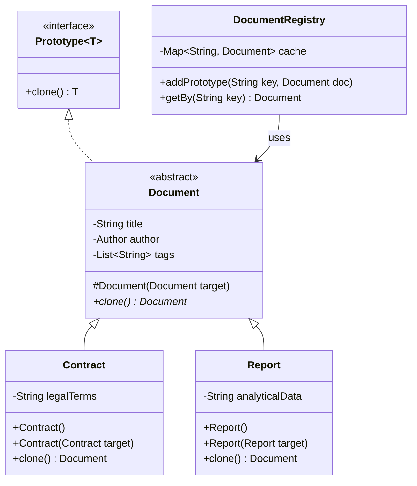

# Prototype Design Pattern

## Overview
The Prototype Pattern is a creational design pattern that lets you copy existing objects without making your code dependent on their classes. Instead of creating an instance of a class from scratch, we delegate the cloning process to the actual objects that are being cloned.

## Problem
In a Document Management System, you often need to create new documents based on standard templates.
Creating an object from scratch and copying all necessary properties from an existing object is problematic:
- **Tedious & Error-Prone:** Copying every field manually is exhausting.
- **Tight Coupling:** You have to know the concrete class to create a new instance (`new Document()`), tying your code to specific classes.
- **Visibility:** Some properties might be private or unreachable from the outside.
- **Open/Closed Principle Violation:** If a new property is added to the object, you must update the manual copy logic everywhere.

## Solution
The Prototype pattern delegates the cloning process to the objects themselves. We define a common interface (`Prototype`) with a `clone()` method. The object is responsible for producing an exact copy of itself (preferably a deep copy, so nested objects don't share references).
This way, the client code can copy objects without knowing their concrete types.

### UML Diagram

## Advantages
- **Alternative to Subclassing:** You can clone predefined objects instead of creating hundreds of subclasses for slightly different configurations.
- **Decoupling:** You can clone objects without coupling to their concrete classes.
- **Performance:** Cloning complex objects is often more efficient and less error-prone than initializing them from scratch.

## Disadvantages
- **Complex Deep Copying:** Cloning objects with complex circular references or deep object graphs can be difficult.

## Use Cases
- Configuration Objects (e.g., UI components that have an initial heavy configuration).
- Document Templates (like Contracts or Reports in this example).
- Spawning characters in a Game (e.g., a "Goblin" template that gets cloned to create 100 goblins).

## Related Patterns
- **Factory Method:** Factory Methods often use Prototypes to avoid subclassing.
- **Abstract Factory:** Abstract Factories can be implemented using Prototypes to avoid creating a hierarchy of factory classes.

## Spring Boot Integration
Spring naturally supports the Prototype pattern via Bean Scopes. By annotating a component with `@Scope("prototype")` (or `ConfigurableBeanFactory.SCOPE_PROTOTYPE`), the Spring IoC container creates a **new instance** of the bean every time it is injected or requested via an `ObjectFactory` / `ApplicationContext`.
