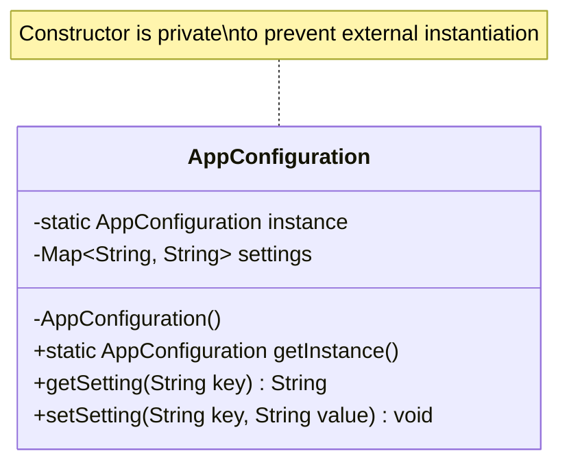

# Singleton Pattern (Mẫu Đơn Lẻ)

## 📌 Overview (Tổng quan)
**Singleton** là một Creational Design Pattern đảm bảo rằng một class chỉ có **duy nhất một instance** hoạt động trong toàn bộ ứng dụng và cung cấp một điểm truy cập toàn cục (global access point) duy nhất đến instance đó.

---

## ⚠️ Problem (Vấn đề đặt ra)
Trong phát triển ứng dụng doanh nghiệp (Enterprise Applications), có những tài nguyên vô cùng quan trọng và đắt đỏ chỉ nên tồn tại một bản duy nhất để tránh xung đột dữ liệu, lãng phí tài nguyên hoặc đồng bộ hóa sai lệch.

Ví dụ:
- **Database Connection Pool**: Quản lý các kết nối tới database. Nếu tạo quá nhiều pool, database sẽ bị cạn kiệt kết nối.
- **Application Configuration**: Các cấu hình toàn cục (App Settings) được đọc từ file `.properties` hoặc `.yaml`. Việc đọc đi đọc lại file cấu hình từ đĩa cứng ở nhiều nơi trong hệ thống sẽ làm giảm hiệu năng đáng kể.
- **Logging Service**: Một tiến trình ghi log dùng chung để ghi tất cả log của ứng dụng vào một file duy nhất.

### Tại sao triển khai thông thường lại thất bại (Violation of SOLID)?
Nếu chúng ta cho phép các lập trình viên tùy ý khởi tạo đối tượng bằng từ khóa `new` (ví dụ: `new AppConfig()`), chúng ta sẽ gặp phải các vấn đề sau:
1. **Vi phạm Single Responsibility Principle (SRP)**: Class vừa phải thực hiện chức năng nghiệp vụ chính của nó, vừa phải tự quản lý vòng đời và số lượng instance của chính mình.
2. **Lãng phí bộ nhớ**: Tạo ra hàng trăm đối tượng giống hệt nhau chứa cùng một tập hợp cấu hình.
3. **Race Condition / Bất đồng bộ dữ liệu**: Khi nhiều luồng cùng ghi hoặc đọc cấu hình và lưu giữ các bản sao khác nhau dẫn đến dữ liệu không nhất quán.

---

## ❌ Before Refactoring (Thiết kế tồi)
Trước khi áp dụng Singleton, mỗi phần của ứng dụng tự tạo ra một instance mới của `AppConfiguration` và thực hiện đọc file cấu hình mỗi lần khởi tạo.

Mã nguồn chi tiết: Xem tại [AppConfiguration.java (Before)](../before/AppConfiguration.java)

### Vấn đề của thiết kế này:
- Mỗi lần gọi `new AppConfiguration()`, hệ thống lại thực hiện I/O đọc file `config.properties`, gây ảnh hưởng nghiêm trọng đến hiệu suất.
- Không có cơ chế đồng bộ giữa các instance. Nếu một instance thay đổi thuộc tính cấu hình lúc runtime, các instance khác không hề hay biết.

---

## ✔️ Pattern Solution (Giải pháp Singleton)
Để hiện thực hóa Singleton một cách chuẩn chỉ và an toàn trong môi trường đa luồng (Multi-threading), chúng ta áp dụng cơ chế **Double-Checked Locking** kết hợp từ khóa `volatile` hoặc sử dụng **Bill Pugh Singleton Implementation** (được khuyến khích trong Java).

Mã nguồn chi tiết: Xem tại [AppConfiguration.java (After)](../after/AppConfiguration.java)

### Các thành phần chính của giải pháp:
1. **Private Constructor**: Ngăn chặn việc khởi tạo trực tiếp lớp này từ bên ngoài bằng từ khóa `new`.
2. **Private Static Instance**: Lưu trữ instance duy nhất của class.
3. **Public Static GetInstance Method**: Điểm truy cập toàn cục duy nhất để lấy đối tượng.

---

## 📊 UML Diagram

---

## ⚖️ Advantages & Disadvantages (Ưu & Nhược điểm)

### Ưu điểm:
* **Single Instance**: Đảm bảo lớp chỉ có duy nhất một đối tượng hoạt động.
* **Controlled Access**: Kiểm soát chặt chẽ điểm truy cập và tài nguyên dùng chung.
* **Lazy Initialization**: Đối tượng chỉ được khởi tạo khi thực sự cần dùng lần đầu tiên (giúp tối ưu bộ nhớ lúc khởi động ứng dụng).

### Nhược điểm:
* **Khó khăn khi Unit Test**: Singleton giữ trạng thái toàn cục, có thể gây ảnh hưởng chéo giữa các ca kiểm thử nếu không được reset đúng cách. Do constructor bị private nên rất khó để Mock.
* **Concurrency Issues**: Cần xử lý thread-safe cẩn thận để tránh race condition trong môi trường đa luồng.
* **Vi phạm SRP**: Lớp vừa xử lý nghiệp vụ, vừa tự kiểm soát số lượng instance của chính mình.

---

## 💼 Real-world Use Case (Ứng dụng thực tế)
Trong các dự án thực tế, Singleton thường được quản lý tự động bởi Spring Framework dưới dạng **Spring Beans** (mặc định scope của Spring Bean là Singleton). Tuy nhiên, hiểu rõ cách triển khai Singleton bằng Pure Java giúp giải quyết các bài toán cấu hình độc lập hoặc khi viết thư viện core.
