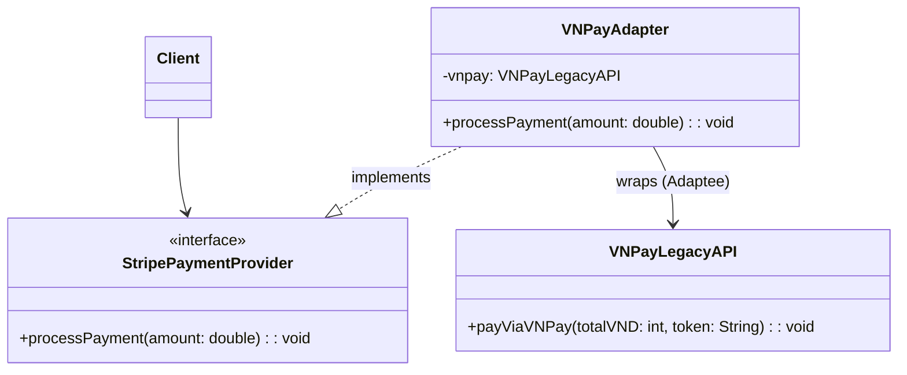

# Adapter Pattern

## Tổng quan (Overview)
**Adapter Pattern** là một design pattern thuộc nhóm Structural (Cấu trúc). Nó hoạt động như một cầu nối giữa hai interface không tương thích với nhau.
Pattern này liên quan đến việc tạo ra một lớp trung gian (Adapter) để cho phép các interface không tương thích có thể làm việc cùng nhau. Nó thường được sử dụng để tích hợp các component hoặc API cũ vào các hệ thống mới mà không cần phải thay đổi mã nguồn của chúng.

## Vấn đề (Problem)
Hãy tưởng tượng bạn đang phát triển một hệ thống thanh toán điện tử (e-commerce). Hệ thống của bạn được thiết kế thống nhất để sử dụng interface `StripePaymentProvider`. 
Tuy nhiên, công ty bạn vừa ký kết đối tác với cổng thanh toán nội địa VNPay, vốn cung cấp một API hoàn toàn khác (`VNPayLegacyAPI`).
- **Nguyên nhân thất bại nếu code trực tiếp:** Nếu bạn sử dụng trực tiếp `VNPayLegacyAPI` trong code nghiệp vụ của mình (Business Logic), code của bạn sẽ bị "trói chặt" (tight coupling) với API của đối tác. Khi đối tác thay đổi API hoặc khi bạn muốn đổi sang đối tác khác, bạn phải sửa đổi rất nhiều chỗ.
- **Vi phạm SOLID:** Điều này vi phạm nguyên tắc **Open/Closed Principle (OCP)** (mở để mở rộng, đóng để sửa đổi) và **Dependency Inversion Principle (DIP)** vì hệ thống cấp cao lại phụ thuộc trực tiếp vào chi tiết triển khai cấp thấp của thư viện bên thứ 3.

## Giải pháp (Solution)
Sử dụng Adapter Pattern:
1. Giữ nguyên interface `StripePaymentProvider` mà hệ thống của bạn mong đợi.
2. Tạo ra một class `VNPayAdapter` implement `StripePaymentProvider`.
3. Bên trong class `VNPayAdapter`, khởi tạo và chứa một đối tượng (hoặc extends) `VNPayLegacyAPI`.
4. Trong các hàm của interface `StripePaymentProvider`, gọi đến các hàm tương ứng của `VNPayLegacyAPI` và thực hiện bất kỳ việc chuyển đổi dữ liệu nào nếu cần thiết.

## UML Diagram

## Ưu điểm (Advantages)
- **Single Responsibility Principle (SRP):** Bạn tách biệt việc chuyển đổi interface hoặc định dạng dữ liệu ra khỏi logic kinh doanh chính của ứng dụng.
- **Open/Closed Principle (OCP):** Bạn có thể đưa các adapter mới vào chương trình mà không làm hỏng các đoạn code client hiện có, giúp dễ dàng tích hợp nhiều hệ thống thanh toán mới sau này.

## Nhược điểm (Disadvantages)
- Độ phức tạp tổng thể của code tăng lên do bạn phải tạo thêm một loạt class và interface mới. Đôi khi, việc chỉ đơn giản thay đổi lớp dịch vụ (Adaptee) cho khớp với phần còn lại của code lại đơn giản hơn.

## Các trường hợp sử dụng (Use Cases)
- **External APIs / 3rd Party Libraries:** Khi cần tích hợp hệ thống với các API của bên thứ ba không có cấu trúc giao diện chuẩn giống với hệ thống của mình (như Payment Gateways, Logging services, SMS services).
- **Hệ thống cũ (Legacy Systems):** Khi cần bọc lại các hệ thống cũ để có thể sử dụng giao diện lập trình mới.

## Các mẫu liên quan (Related Patterns)
- **Bridge Pattern:** Có cấu trúc gần giống Adapter, nhưng mục đích của Bridge là tách biệt Interface ra khỏi Implementation, trong khi Adapter là thay đổi giao diện của một đối tượng đang có.
- **Decorator Pattern:** Decorator mở rộng hành vi của một đối tượng mà không thay đổi giao diện, trong khi Adapter thay đổi giao diện của đối tượng.
- **Facade Pattern:** Tạo ra một giao diện mới để đơn giản hóa một hệ thống phức tạp, còn Adapter dùng cho một đối tượng để khớp với giao diện sẵn có.

## Tài liệu tham khảo (References)
- [Refactoring.guru - Adapter Pattern](https://refactoring.guru/design-patterns/adapter)
- Head First Design Patterns (O'Reilly)
