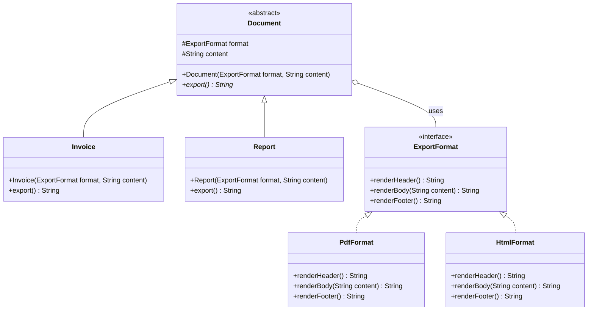

# Bridge Pattern

## Overview
Bridge Pattern là một mẫu thiết kế thuộc nhóm Structural (Cấu trúc), giúp tách biệt phần trừu tượng (Abstraction) khỏi phần triển khai (Implementation) để cả hai có thể thay đổi độc lập.

## Problem
Giả sử bạn có một hệ thống quản lý tài liệu. Ban đầu, bạn có 2 loại tài liệu: Hóa đơn (`Invoice`) và Báo cáo (`Report`). Bạn cần xuất chúng ra 2 định dạng: `PDF` và `HTML`. 
Nếu thiết kế bằng cách dùng tính kế thừa, bạn sẽ có các lớp: `PdfInvoice`, `HtmlInvoice`, `PdfReport`, `HtmlReport`.
Vấn đề xảy ra khi bạn cần thêm loại tài liệu mới (như `Receipt`) hoặc định dạng xuất mới (như `CSV`). Số lượng các lớp con (subclasses) sẽ bùng nổ theo cấp số nhân (Cartesian product), dẫn đến việc bảo trì và mở rộng trở nên vô cùng khó khăn. Việc này vi phạm các nguyên tắc Open/Closed Principle (OCP) và Single Responsibility Principle (SRP).

## Solution
Bridge Pattern giải quyết vấn đề này bằng cách chuyển đổi cấu trúc kế thừa sang dạng kết hợp (composition). Thay vì cố gắng chứa mọi thứ trong một hệ thống phân cấp duy nhất, mẫu thiết kế chia cấu trúc thành 2 phần độc lập:
1. **Abstraction**: Lớp cha cao nhất quản lý một tham chiếu đến Implementor (`Document`). Nó chứa các lớp con là **Refined Abstraction** (`Invoice`, `Report`).
2. **Implementor**: Lớp định nghĩa giao diện (Interface) để thực hiện phần triển khai cụ thể (`ExportFormat`). Nó chứa các lớp con là **Concrete Implementor** (`PdfFormat`, `HtmlFormat`).

Thay vì phải tạo ra hàng loạt class kết hợp (ví dụ `PdfInvoice`), `Document` bây giờ chỉ cần chứa một đối tượng `ExportFormat`.

## UML

## Advantages
- Độc lập nền tảng, tách biệt hoàn toàn phần giao diện (abstraction) và triển khai (implementation).
- Giúp mở rộng các tính năng mới một cách linh hoạt, mỗi chiều có thể phát triển riêng biệt (thêm loại Document hoặc thêm Format) mà không phải sửa đổi code của chiều kia.
- Đáp ứng tốt nguyên tắc OCP và SRP, tránh "bùng nổ số lượng class".

## Disadvantages
- Có thể làm cho source code phức tạp hơn khi đọc do phải tạo thêm nhiều class, interface và ủy quyền (delegation) qua đối tượng liên quan.
- Thường khó để áp dụng vào một dự án đang có sẵn và có tính liên kết chặt chẽ.

## Use Cases
- Hệ thống xuất file đa nền tảng hoặc đa định dạng (như ví dụ này).
- Hệ thống UI Rendering: Có đa nền tảng (Windows, Mac, Linux) và đa Control (Button, Checkbox, TextField).
- Ứng dụng Messaging/Notification: Có nhiều loại thông báo (SMS, Email, Push Notification) và nhiều kiểu nội dung (Cảnh báo, Tin nhắn thường, Tin khuyến mãi).

## Related Patterns
- **Adapter**: Adapter làm cho các lớp không liên quan có thể làm việc cùng nhau (thường áp dụng cho class đã có sẵn). Bridge tách biệt trừu tượng và cài đặt từ khi bắt đầu thiết kế.
- **State, Strategy**: Tương tự Bridge ở chỗ dựa trên việc ủy quyền công việc cho một đối tượng khác, nhưng mục đích sử dụng khác nhau.
- **Abstract Factory**: Thường được sử dụng kết hợp với Bridge để quyết định xem Concrete Implementor nào sẽ được Abstraction khởi tạo và sử dụng.
