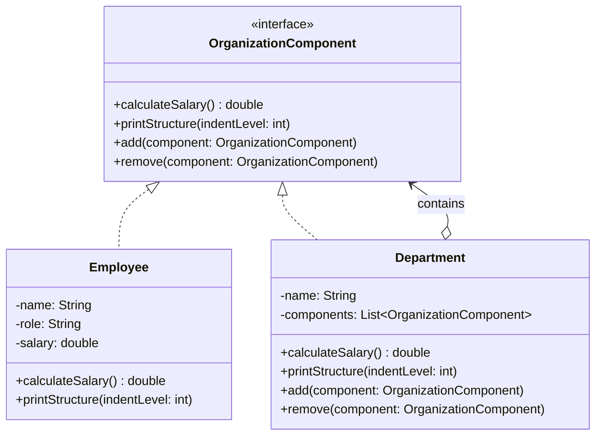

# Composite Pattern

## Overview

**Composite Pattern** (Mẫu cấu trúc phức hợp) là một Design Pattern thuộc nhóm **Structural Pattern** (Mẫu cấu trúc). Nó cho phép bạn kết hợp các đối tượng thành các cấu trúc dạng cây (tree structures) để đại diện cho hệ thống phân cấp part-whole (phần-toàn thể). Composite cho phép các client đối xử với các đối tượng độc lập và các thành phần cấu tạo từ các đối tượng một cách thống nhất.

Nói một cách đơn giản, Composite Pattern giúp bạn xử lý một đối tượng đơn lẻ (Leaf) và một nhóm đối tượng (Composite) thông qua một interface chung mà không cần phải phân biệt chúng.

## Problem

Hãy tưởng tượng bạn đang xây dựng một ứng dụng Quản lý cấu trúc tổ chức (Organization Structure).
Trong công ty, bạn có **Phòng ban** (Department) và **Nhân viên** (Employee). Một phòng ban có thể chứa nhiều nhân viên, và cũng có thể chứa các phòng ban con nhỏ hơn.

Yêu cầu đặt ra là: Bạn cần tính tổng lương của một phòng ban bất kỳ (bao gồm lương của tất cả nhân viên trực tiếp và nhân viên thuộc các phòng ban con).

**Cách làm truyền thống:**
Bạn sẽ phải duyệt qua danh sách các thành phần của phòng ban. Nếu thành phần là một `Employee`, bạn lấy lương của họ. Nếu thành phần là một `Department` con, bạn phải gọi đệ quy để tính tổng lương của phòng ban con đó. 

Điều này dẫn đến:
*   Mã nguồn (Client Code) phải dùng nhiều câu lệnh `if/else` hoặc `instanceof` để kiểm tra xem đối tượng hiện tại là Node lá hay Node nhánh.
*   **Vi phạm Open/Closed Principle (OCP):** Khi bạn thêm một loại thành phần mới (ví dụ `Freelancer Team`), bạn phải cập nhật logic tính toán ở tất cả mọi nơi.
*   Mã nguồn trở nên phức tạp, khó bảo trì.

## Solution

Composite Pattern gợi ý rằng bạn nên làm việc với `Employee` và `Department` thông qua một **Interface chung** (ví dụ: `OrganizationComponent`), trong đó khai báo một phương thức tính lương chung `calculateSalary()`.

*   **Với Employee (Leaf):** Phương thức `calculateSalary()` chỉ đơn giản trả về mức lương của nhân viên đó.
*   **Với Department (Composite):** Phương thức `calculateSalary()` sẽ duyệt qua tất cả các thành phần con của nó (bất kể đó là Employee hay Department con), gọi phương thức `calculateSalary()` của chúng và tính tổng kết quả.

Client Code giờ đây không cần biết nó đang làm việc với một nhân viên đơn lẻ hay toàn bộ một phòng ban phức tạp. Nó chỉ cần gọi `calculateSalary()` và để các đối tượng tự xử lý.

## UML Diagram

### Thành phần tham gia:
1.  **Component (`OrganizationComponent`):** Khai báo interface chung cho các đối tượng trong composition. Có thể triển khai hành vi mặc định cho các phương thức quản lý con (như `add`, `remove`).
2.  **Leaf (`Employee`):** Đại diện cho các đối tượng lá trong thành phần cấu tạo. Một leaf không có đối tượng con. Định nghĩa hành vi cho các đối tượng nguyên thủy.
3.  **Composite (`Department`):** Đại diện cho các thành phần có chứa các thành phần con. Lưu trữ các thành phần con và thực thi các phương thức liên quan đến con (như `calculateSalary()` theo kiểu đệ quy).

## Advantages & Disadvantages

### Ưu điểm (Advantages)
*   **Xử lý đồng nhất (Uniformity):** Client có thể đối xử với các đối tượng đơn lẻ và các thành phần cấu tạo từ nhiều đối tượng một cách giống nhau.
*   **Open/Closed Principle:** Bạn có thể giới thiệu các loại phần tử (Component) mới vào ứng dụng mà không làm hỏng đoạn code hiện tại, cấu trúc cây cũng có thể mở rộng dễ dàng.
*   **Làm việc dễ dàng với cấu trúc cây phức tạp:** Dễ dàng thêm mới nhánh, lá, di chuyển cấu trúc nhờ tính đệ quy của pattern.

### Nhược điểm (Disadvantages)
*   **Khó hạn chế các thành phần con:** Việc thiết kế Interface chung có thể trở nên khó khăn. Ví dụ: bạn không muốn cho phép `Leaf` có các hàm `add()` hay `remove()`, nhưng Interface bắt buộc phải có. Nếu đặt các hàm đó vào Interface, bạn vi phạm *Interface Segregation Principle* hoặc phải ném ra Exception ở cấp độ Leaf. (Cách tiếp cận "Transparency" vs "Safety").

## Use Cases

1.  **Cấu trúc thư mục (File System):** Quản lý Thư mục (Directory) và Tập tin (File). Cả hai đều có thể trả về kích thước (size) hoặc tên của chúng.
2.  **Hệ thống Menu UI:** Menu cấp cao nhất, các Menu con, và Menu Item (Lá). Action nhấp chuột có thể được xử lý đồng nhất.
3.  **Quản lý giá cả sản phẩm (Product Catalog):** Một Product Box có thể chứa nhiều Product Item đơn lẻ hoặc các Product Box nhỏ hơn bên trong. Tổng giá trị của Box bằng tổng giá trị của tất cả items bên trong nó.

## Related Patterns
*   **Builder Pattern:** Có thể được sử dụng để tạo ra các cấu trúc Composite phức tạp từng bước một.
*   **Iterator Pattern:** Thường được sử dụng để duyệt qua các thành phần (components) trong cây Composite.
*   **Visitor Pattern:** Hữu ích nếu bạn muốn tách một thao tác cụ thể khỏi cấu trúc các đối tượng, thay vì định nghĩa thao tác đó trực tiếp trên interface của Composite (Ví dụ: tách tính năng xuất XML ra khỏi Component).

## References
*   [Refactoring.guru - Composite Pattern](https://refactoring.guru/design-patterns/composite)
*   [Baeldung - Composite Design Pattern in Java](https://www.baeldung.com/java-composite-pattern)
