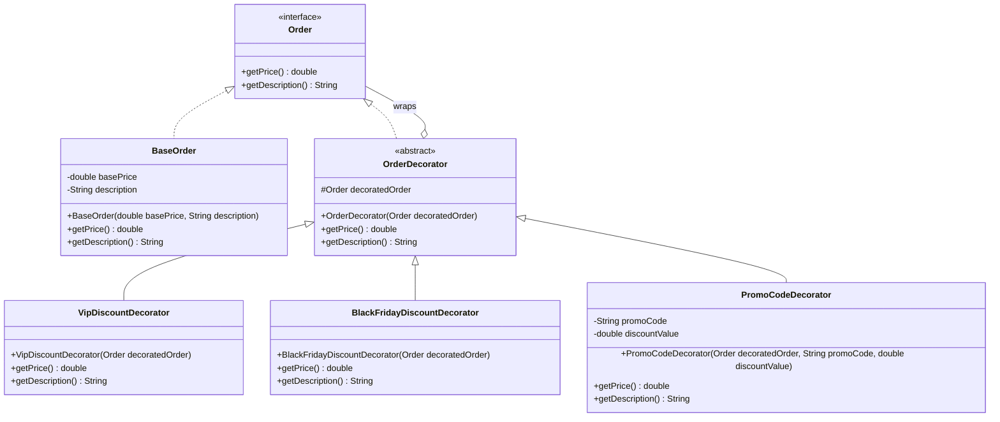

# Decorator Pattern (Mẫu thiết kế Trang trí)

## Overview
**Decorator Pattern** là một mẫu thiết kế thuộc nhóm **Structural (Cấu trúc)**, cho phép bổ sung tính năng hoặc hành vi mới vào một đối tượng một cách động (tại runtime) mà không làm ảnh hưởng đến các đối tượng khác thuộc cùng một lớp, và không phải chỉnh sửa code của lớp gốc. 

Nó thường được sử dụng như một giải pháp thay thế linh hoạt cho việc kế thừa (subclassing) để mở rộng chức năng. Thay vì kế thừa lớp để thêm tính năng mới, chúng ta sẽ "bọc" (wrap) đối tượng gốc bằng một đối tượng decorator khác.

---

## Problem
Hãy tưởng tượng bạn đang xây dựng một **Hệ thống tính toán giá đơn hàng (Discount System)** cho trang thương mại điện tử. 
Ban đầu, hệ thống chỉ có một loại đơn hàng cơ bản với giá gốc. Sau đó, nghiệp vụ yêu cầu áp dụng các chương trình khuyến mãi/giảm giá xếp chồng (có thể kết hợp đồng thời):
1. Giảm giá cho khách hàng VIP (10% off).
2. Giảm giá nhân dịp lễ Black Friday (20% off).
3. Áp dụng mã giảm giá Promo Code (Giảm số tiền cố định ví dụ -$10, -$20).

### Thiết kế truyền thống (Dùng Kế thừa hoặc Cờ hiệu)
* **Phương án 1 (Kế thừa):** Tạo ra các lớp con để biểu diễn mọi sự kết hợp: `VipOrder`, `BlackFridayOrder`, `VipBlackFridayOrder`, `VipPromoCodeOrder`, `VipBlackFridayPromoCodeOrder`... Cách này dẫn đến **bùng nổ số lượng lớp con (class explosion)** và cực kỳ khó duy trì khi xuất hiện thêm loại giảm giá thứ 4, thứ 5.
* **Phương án 2 (Dùng cờ hiệu & logic if-else lồng nhau):** Đưa tất cả các cờ `isVip`, `isBlackFriday`, `promoCode` vào một lớp `Order` duy nhất. Trong phương thức `calculatePrice()`, ta viết một chuỗi logic `if-else` dài để tính toán. 
  - **Hệ quả**: Vi phạm nguyên tắc **Open/Closed Principle (OCP)** (mỗi khi có chương trình giảm giá mới, ta phải sửa file `Order`) và **Single Responsibility Principle (SRP)** (lớp `Order` vừa lưu thông tin vừa gánh vác thuật toán giảm giá).

---

## Solution
**Decorator Pattern** giải quyết triệt để vấn đề này bằng cách chuyển từ cơ chế kế thừa sang cơ chế **kết hợp (Composition & Delegation)**:

1. **Component (`Order`)**: Định nghĩa interface chung cho cả đơn hàng cơ bản và các bộ trang trí (decorators).
2. **Concrete Component (`BaseOrder`)**: Đại diện cho thực thể đơn hàng cơ bản nhất có giá gốc và mô tả nguyên bản.
3. **Decorator (`OrderDecorator`)**: Lớp trừu tượng cũng triển khai interface `Order`, nhưng chứa một tham chiếu tới đối tượng `Order` khác (được bọc). Nó sẽ ủy quyền các hành động của mình cho đối tượng được bọc đó.
4. **Concrete Decorators (`VipDiscountDecorator`, `BlackFridayDiscountDecorator`, `PromoCodeDecorator`)**: Các lớp trang trí cụ thể. Chúng ghi đè các phương thức để thêm logic giảm giá của riêng mình lên trên giá trị trả về của đối tượng được bọc.

Nhờ cấu trúc này, ta có thể kết hợp các loại giảm giá một cách động tại runtime bằng cách xếp chồng các lớp trang trí:
```java
Order order = new BaseOrder(100.0, "Bàn phím cơ");
order = new VipDiscountDecorator(order); // Bọc VIP
order = new BlackFridayDiscountDecorator(order); // Bọc Black Friday
order = new PromoCodeDecorator(order, "SAVE10", 10.0); // Bọc Promo Code
```

---

## UML Diagram



---

## Advantages (Ưu điểm)
* **Linh hoạt cao**: Cho phép thêm/bớt hành vi của đối tượng tại runtime mà không cần biên dịch lại mã nguồn của lớp gốc.
* **Tuân thủ nguyên tắc Single Responsibility Principle (SRP)**: Tách biệt các tính năng giảm giá phụ trợ ra khỏi lớp đơn hàng gốc. Mỗi decorator chỉ tập trung vào một nhiệm vụ (VIP discount, VAT tax, shipping...).
* **Tuân thủ nguyên tắc Open/Closed Principle (OCP)**: Dễ dàng thêm các bộ giảm giá mới (ví dụ `BirthdayDiscountDecorator`) bằng cách viết lớp decorator mới mà không cần chỉnh sửa code của bất kỳ decorator hay lớp đơn hàng sẵn có nào.
* **Cho phép xếp chồng (stacking)**: Bọc một đối tượng qua nhiều tầng decorator khác nhau để có các tổ hợp hành vi phức tạp.

## Disadvantages (Nhược điểm)
* **Khó debug**: Việc gỡ lỗi (debugging) có thể khó khăn khi có quá nhiều lớp trang trí bọc chồng lên nhau, do luồng xử lý đi qua nhiều tầng ủy quyền.
* **Phức tạp về số lượng đối tượng**: Tạo ra nhiều đối tượng nhỏ, tương tự nhau tại runtime (ví dụ các decorator instance), làm tăng bộ nhớ sử dụng nhẹ và tăng độ phức tạp khi khởi tạo cấu trúc đối tượng ban đầu.

---

## Use Cases (Trường hợp áp dụng)
1. **Java I/O Streams**: Đây là thư viện áp dụng Decorator Pattern kinh điển nhất. 
   - `InputStream` là Component.
   - `FileInputStream` là Concrete Component.
   - `BufferedInputStream` và `DataInputStream` là các Decorator.
   - Sử dụng: `InputStream is = new BufferedInputStream(new FileInputStream("file.txt"));`
2. **Hệ thống tính giá và thanh toán**: Giảm giá, phụ thu, thuế (VAT), phí vận chuyển có thể được bọc chồng lên đơn hàng cơ bản.
3. **UI Components / Graphic Rendering**: Bọc một cửa sổ cơ bản (`Window`) với thanh cuộn dọc (`VerticalScrollBarDecorator`), thanh cuộn ngang (`HorizontalScrollBarDecorator`) và đường viền (`BorderDecorator`).
4. **Spring AOP & Proxying**: Spring sử dụng cơ chế proxy hoạt động tương tự decorator để bọc các bean gốc nhằm bổ sung tính năng như `@Transactional`, `@Cacheable`, `@SecurityCheck`.

---

## Related Patterns
* **Adapter Pattern**: Thay đổi giao diện (interface) của một đối tượng có sẵn để tương thích với hệ thống khác. Trong khi đó, **Decorator** giữ nguyên giao diện gốc của đối tượng và chỉ tăng cường thêm hành vi.
* **Composite Pattern**: Cả hai mẫu đều dựa trên mô hình cấu trúc cây phân cấp đệ quy. Tuy nhiên, Composite dùng để quản lý quan hệ "bộ phận - toàn bộ" (part-whole) giữa các đối tượng, còn Decorator chỉ tập trung vào việc thêm các trách nhiệm phụ trợ cho một đối tượng đơn lẻ.
* **Strategy Pattern**: Thay đổi "lõi bên trong" (thuật toán) của đối tượng bằng cách hoán đổi đối tượng strategy. Ngược lại, **Decorator** thay đổi lớp vỏ bên ngoài bằng cách bọc đối tượng gốc.

---

## References
* Head First Design Patterns (2nd Edition) - Chapter 3: Decorator Pattern.
* Refactoring.Guru - [Decorator Pattern](https://refactoring.guru/design-patterns/decorator)
