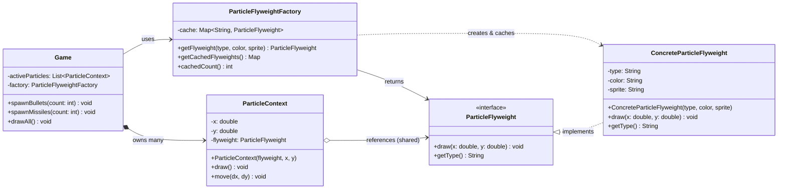

# Flyweight Pattern (Mẫu thiết kế Flyweight)

## Overview

**Flyweight Pattern** là một mẫu thiết kế thuộc nhóm **Structural (Cấu trúc)**. Mục tiêu cốt lõi của nó là **tiết kiệm bộ nhớ RAM** bằng cách chia sẻ các phần dữ liệu **dùng chung** giữa một lượng lớn các đối tượng tương tự nhau, thay vì lưu trữ chúng riêng lẻ trong từng đối tượng.

Tên "Flyweight" (võ sĩ hạng ruồi) ám chỉ việc làm cho các đối tượng trở nên **cực kỳ nhẹ** về mặt bộ nhớ.

> **Nguyên lý cốt lõi**: Tách trạng thái của một đối tượng thành hai phần:
> - **Intrinsic State (Trạng thái nội tại)** — bất biến, chia sẻ → lưu trong Flyweight.
> - **Extrinsic State (Trạng thái ngoại vi)** — thay đổi theo ngữ cảnh → truyền vào khi gọi.

---

## Problem

Hãy tưởng tượng bạn đang xây dựng một **Game bắn súng (Shooting Game)** có khả năng hiển thị hàng triệu hạt (particle) trên màn hình cùng lúc: đạn (bullet), tên lửa (missile), mảnh vỡ (shrapnel)...

### Thiết kế ngây thơ (Không dùng Flyweight)

```java
// Mỗi hạt là một object đầy đủ:
public class Particle {
    private String color;   // "RED" — giống hệt nhau cho mọi viên đạn
    private String sprite;  // "bullet.png" — ~2MB, giống hệt nhau cho mọi viên đạn
    private double x;       // khác nhau
    private double y;       // khác nhau
}
```

**Vấn đề**: Spawning 1.000.000 viên đạn "RED" đồng nghĩa với:
- 1.000.000 bản sao của chuỗi `"RED"`.
- 1.000.000 bản sao của dữ liệu sprite `"bullet.png"` (~2MB/sprite → **~2 TB RAM** chỉ cho sprite!).
- Ứng dụng crash hoặc lag nghiêm trọng do hết bộ nhớ.

### SOLID Principles bị vi phạm

| Nguyên tắc | Vi phạm |
|---|---|
| **SRP** | Class `Particle` chịu trách nhiệm cả dữ liệu hiển thị (color, sprite) lẫn vị trí (x, y) — hai concerns khác nhau. |
| **DRY** | Dữ liệu dùng chung (`color`, `sprite`) bị nhân bản (duplicate) vào hàng triệu object. |

---

## Solution

**Flyweight Pattern** tách đối tượng thành hai phần độc lập:

| Thành phần | Vai trò | Ví dụ |
|---|---|---|
| **Flyweight** | Lưu *intrinsic state* (bất biến, chia sẻ) | `color="RED"`, `sprite="bullet.png"` |
| **Context** | Lưu *extrinsic state* (thay đổi theo ngữ cảnh) + tham chiếu đến Flyweight | `x=120.5`, `y=340.2` |
| **Factory** | Cache và tái sử dụng Flyweight object | `Map<type, Flyweight>` |

Kết quả: Dù có 1.000.000 viên đạn, chỉ có **MỘT** `ConcreteParticleFlyweight` với `type="BULLET"` tồn tại trong bộ nhớ.

---

## Before Refactoring

```java
// ❌ Mỗi Particle lưu toàn bộ dữ liệu — kể cả dữ liệu giống nhau
public class Particle {
    private final String color;   // "RED" — bị nhân bản 1,000,000 lần
    private final String sprite;  // "bullet.png" — bị nhân bản 1,000,000 lần
    private double x;             // khác nhau (ok)
    private double y;             // khác nhau (ok)

    public Particle(String color, String sprite, double x, double y) { ... }
    public void draw() { /* sử dụng color, sprite, x, y */ }
}

// Client tạo object riêng lẻ cho từng hạt:
for (int i = 0; i < 1_000_000; i++) {
    particles.add(new Particle("RED", "bullet.png", randomX(), randomY()));
    //                          ^^^    ^^^^^^^^^^^
    //                          Dữ liệu này được sao chép 1,000,000 lần!
}
```

---

## Pattern Solution

### 1. Flyweight Interface

```java
public interface ParticleFlyweight {
    void draw(double x, double y);   // x, y là extrinsic state — truyền vào khi gọi
    String getType();
}
```

### 2. Concrete Flyweight (lưu intrinsic state)

```java
public class ConcreteParticleFlyweight implements ParticleFlyweight {
    // ✅ Intrinsic state — final, immutable, SHARED
    private final String type;
    private final String color;
    private final String sprite;

    @Override
    public void draw(double x, double y) {
        // Kết hợp intrinsic (color, sprite) + extrinsic (x, y) khi render
        System.out.printf("Drawing [%s | %s | %s] at (%.1f, %.1f)%n",
                type, color, sprite, x, y);
    }
}
```

### 3. Context (lưu extrinsic state)

```java
public class ParticleContext {
    private double x;              // extrinsic state
    private double y;              // extrinsic state
    private final ParticleFlyweight flyweight;  // CHỈ LÀ THAM CHIẾU, không phải bản sao

    public void draw() {
        flyweight.draw(x, y);  // delegate + truyền extrinsic state
    }
}
```

### 4. Flyweight Factory (cache & reuse)

```java
public class ParticleFlyweightFactory {
    private final Map<String, ParticleFlyweight> cache = new HashMap<>();

    public ParticleFlyweight getFlyweight(String type, String color, String sprite) {
        return cache.computeIfAbsent(type,
                key -> new ConcreteParticleFlyweight(key, color, sprite));
        //                ^^^^^^^^^^^^^^^^^^^^^^^^^^
        //                Chỉ tạo MỚI nếu chưa có trong cache!
    }
}
```

### 5. Client (Game)

```java
// ✅ Dù spawn 1,000,000 viên đạn, chỉ có 1 Flyweight "BULLET" tồn tại
for (int i = 0; i < 1_000_000; i++) {
    ParticleFlyweight fw = factory.getFlyweight("BULLET", "RED", "bullet.png");
    activeParticles.add(new ParticleContext(fw, randomX(), randomY()));
}
// factory.cachedCount() == 1 ← chỉ 1 object được chia sẻ!
```

---

## UML Diagram



### Giải thích ký hiệu UML

| Ký hiệu | Quan hệ | Ý nghĩa |
|---|---|---|
| `<\|..` | Realization | `ConcreteParticleFlyweight` implements `ParticleFlyweight` |
| `..>` | Dependency | Factory phụ thuộc vào Concrete Flyweight để tạo object |
| `o-->` | Aggregation | Context tham chiếu Flyweight (KHÔNG sở hữu) |
| `*-->` | Composition | Game sở hữu danh sách Context |

---

## Advantages (Ưu điểm)

- **Tiết kiệm bộ nhớ đáng kể**: Tỉ lệ tiết kiệm tỉ lệ thuận với số lượng đối tượng và kích thước intrinsic state. Với game có 1.000.000 bullet: từ 1.000.000 object xuống còn 1 flyweight object cho "BULLET".
- **Tăng hiệu năng**: Ít object hơn → ít garbage collection → ứng dụng mượt hơn.
- **Tuân thủ SRP**: Tách biệt rõ ràng intrinsic state (Flyweight) và extrinsic state (Context).
- **Tuân thủ DRY**: Không lặp lại dữ liệu dùng chung.

## Disadvantages (Nhược điểm)

- **Phức tạp hơn**: Cần tách biệt rõ ràng intrinsic vs. extrinsic state — đôi khi khó phân biệt.
- **Trade-off CPU vs. RAM**: Extrinsic state phải được tính toán hoặc tra cứu mỗi lần gọi (nhưng thường chấp nhận được).
- **Khó debug**: Object được chia sẻ — bug ở Flyweight ảnh hưởng tất cả các Context dùng nó.
- **Không phù hợp** nếu số lượng đối tượng ít hoặc dữ liệu chia sẻ không đáng kể.

---

## Use Cases (Trường hợp áp dụng)

| Domain | Ví dụ áp dụng | Intrinsic state | Extrinsic state |
|---|---|---|---|
| **Game Development** | Particle systems (đạn, khói, lửa) | sprite, color, animation | x, y, velocity |
| **Text Rendering** | Ký tự trong font rendering | glyph bitmap, font metrics | x, y, color |
| **GIS / Maps** | Markers trên bản đồ | icon, category | lat, lng |
| **E-commerce** | Catalogue listing (nhiều seller, 1 product) | name, category, thumbnail | price, seller |
| **Java Core** | `Integer.valueOf()`, `String.intern()` | giá trị số/chuỗi | vị trí biến |

### Ví dụ từ Java Standard Library

```java
// Integer Pool: các giá trị từ -128 đến 127 được cache (flyweight!)
Integer a = Integer.valueOf(100);
Integer b = Integer.valueOf(100);
System.out.println(a == b);  // true ← CÙNG 1 OBJECT!

Integer c = Integer.valueOf(200);
Integer d = Integer.valueOf(200);
System.out.println(c == d);  // false ← ngoài range cache → object mới

// String Pool: string literals được intern (flyweight!)
String s1 = "hello";
String s2 = "hello";
System.out.println(s1 == s2);  // true ← CÙNG 1 OBJECT từ String Pool!
```

---

## Package Structure

```text
structural/flyweight/
├── before/
│   ├── Particle.java                    ← Problematic: mọi field trong 1 class
│   └── GameWithoutFlyweight.java        ← Client demo vấn đề bộ nhớ
├── after/
│   ├── ParticleFlyweight.java           ← Flyweight Interface
│   ├── ConcreteParticleFlyweight.java   ← Concrete Flyweight (intrinsic state)
│   ├── ParticleContext.java             ← Context (extrinsic state)
│   ├── ParticleFlyweightFactory.java    ← Factory (cache & reuse)
│   └── Game.java                        ← Client demo
├── spring/
│   ├── ProductTemplateFlyweight.java    ← E-commerce flyweight
│   ├── ProductListingContext.java       ← Listing context
│   ├── ProductFlyweightFactory.java     ← @Component Spring factory
│   ├── CatalogueService.java            ← @Service với DI
│   └── Application.java                 ← Spring Boot entry point
├── tests/
│   └── FlyweightPatternTest.java        ← Unit tests (JUnit 5)
└── docs/
    └── README.md                         ← Tài liệu này
```

---

## Related Patterns

- **Singleton Pattern**: Flyweight Factory thường là một Singleton để đảm bảo chỉ có một cache duy nhất trong ứng dụng. Spring `@Component` bean đạt được điều này tự động.
- **Factory Method / Abstract Factory**: Factory trong Flyweight Pattern đảm nhiệm việc tạo và quản lý vòng đời của flyweight objects.
- **Composite Pattern**: Thường dùng kết hợp — Composite xây dựng cây phân cấp đối tượng, Flyweight giảm bộ nhớ của các lá (leaf nodes) trong cây đó.
- **Proxy Pattern**: Cũng sử dụng cơ chế bọc (wrapping) đối tượng, nhưng mục đích là kiểm soát truy cập thay vì tiết kiệm bộ nhớ.
- **State Pattern**: Các state objects thường là các flyweight (ít trạng thái, dùng chung giữa các context machines).

---

## References

- **GoF Book**: *Design Patterns: Elements of Reusable Object-Oriented Software* — Gamma, Helm, Johnson, Vlissides. Chapter: Structural Patterns → Flyweight.
- **Refactoring.Guru**: [Flyweight Pattern](https://refactoring.guru/design-patterns/flyweight)
- **Head First Design Patterns** (2nd Edition) — O'Reilly.
- **Java Source**: `java.lang.Integer#valueOf(int)`, `java.lang.String#intern()`
