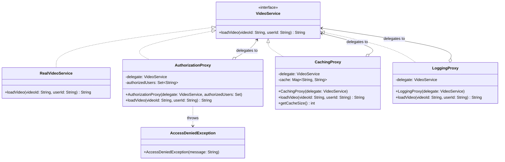

# Proxy Pattern (Mẫu thiết kế Proxy)

## Overview

**Proxy Pattern** là một mẫu thiết kế thuộc nhóm **Structural (Cấu trúc)**, cung cấp một đối tượng **đại diện (surrogate)** hoặc **giữ chỗ (placeholder)** đứng trước đối tượng thực sự, nhằm kiểm soát quyền truy cập vào đối tượng đó.

Thay vì client giao tiếp trực tiếp với real object, client tương tác với proxy. Proxy nhận yêu cầu, thực hiện các xử lý phụ trợ (authorization, caching, logging, lazy initialization...) rồi **ủy quyền (delegate)** yêu cầu đến real object. Client không cần biết và không cần thay đổi khi proxy được thêm vào.

---

## Problem

Hãy tưởng tượng bạn xây dựng một **Hệ thống streaming video** (giống Netflix/YouTube). Ban đầu, hệ thống có một `VideoService` đơn giản tải video từ remote storage.

Dần dần, hệ thống cần thêm các yêu cầu:
1. **Authorization**: Chỉ user Premium/Admin mới được xem video.
2. **Caching**: Video đã tải không nên tải lại từ server lần thứ hai (tốn kém).
3. **Audit Logging**: Ghi lại ai xem video nào để phân tích và compliance.

### Giải pháp truyền thống (sai)

Nhồi tất cả vào một class duy nhất:

```java
public class VideoService {
    private final Map<String, String> cache = new HashMap<>();

    public String loadVideo(String videoId, String userId) {
        // 1. Authorization (hardcoded)
        if (!"premium_user".equals(userId) && !"admin".equals(userId)) {
            return "ACCESS DENIED";
        }
        // 2. Cache check
        if (cache.containsKey(videoId)) { return cache.get(videoId); }
        // 3. Load
        String content = fetchFromRemote(videoId);
        cache.put(videoId, content);
        // 4. Audit log
        System.out.println("[AUDIT] " + userId + " accessed " + videoId);
        return content;
    }
}
```

**Hệ quả vi phạm SOLID:**
| Nguyên tắc | Vi phạm |
|---|---|
| **SRP** | Một class gánh 4 trách nhiệm: load video, auth, cache, log |
| **OCP** | Thêm rate-limiting hay IP filtering → phải sửa class này |
| **DIP** | Client phụ thuộc trực tiếp vào class cụ thể, không có abstraction |

---

## Solution

**Proxy Pattern** giải quyết bằng cách tách mỗi cross-cutting concern vào một proxy riêng biệt, xếp thành một **chuỗi (chain)**:

```
Client
  └─► LoggingProxy          (ghi log trước & sau)
        └─► AuthorizationProxy  (kiểm tra quyền)
              └─► CachingProxy      (tra cache)
                    └─► RealVideoService  (tải thực sự)
```

Mỗi lớp trong chain:
1. **`VideoService`** — Subject interface: contract chung cho proxy và real object.
2. **`RealVideoService`** — Real Subject: chỉ biết tải video, không biết gì về auth/cache/log.
3. **`AuthorizationProxy`** — Protection Proxy: chặn user không hợp lệ, delegate cho phép.
4. **`CachingProxy`** — Virtual/Caching Proxy: trả cache nếu có, otherwise delegate.
5. **`LoggingProxy`** — Logging Proxy: ghi audit log, luôn delegate.

---

## UML Diagram



---

## Code Example — Cách sử dụng (Client)

```java
// Xây dựng chuỗi proxy từ trong ra ngoài
VideoService service = new LoggingProxy(          // Layer ngoài cùng
    new AuthorizationProxy(
        new CachingProxy(
            new RealVideoService()                // Layer trong cùng
        ),
        Set.of("premium_user", "admin")
    )
);

// Lần 1: premium_user xem video-101
// → LoggingProxy log request
// → AuthorizationProxy: PASS
// → CachingProxy: MISS → gọi RealVideoService
// → RealVideoService: fetch từ remote storage
// → CachingProxy: lưu vào cache
// → LoggingProxy log response
String content = service.loadVideo("video-101", "premium_user");

// Lần 2: premium_user xem lại video-101
// → CachingProxy: HIT → trả ngay, KHÔNG gọi RealVideoService
content = service.loadVideo("video-101", "premium_user");

// Lần 3: guest_user không có quyền
// → AuthorizationProxy: FAIL → ném AccessDeniedException
service.loadVideo("video-101", "guest_user"); // throws!
```

### Giải thích từng bước

| Bước | Class | Hành động |
|------|-------|-----------|
| 1 | `LoggingProxy` | Log `REQUEST — user=premium_user, video=video-101` |
| 2 | `AuthorizationProxy` | Kiểm tra `authorizedUsers.contains("premium_user")` → `true` |
| 3 | `CachingProxy` | `cache.containsKey("video-101")` → `false` → cache MISS |
| 4 | `RealVideoService` | `fetchFromRemote("video-101")` → trả về nội dung video |
| 5 | `CachingProxy` | Lưu kết quả vào `cache` |
| 6 | `LoggingProxy` | Log `RESPONSE — contentLength=...` |

---

## Advantages (Ưu điểm)

* **Tuân thủ SRP**: Mỗi proxy chỉ chịu một trách nhiệm duy nhất (auth, cache, log).
* **Tuân thủ OCP**: Thêm proxy mới (rate-limiting, encryption...) bằng cách viết class mới, không đụng code cũ.
* **Transparent với Client**: Client không biết và không cần thay đổi khi proxy được thêm/bớt.
* **Kiểm soát linh hoạt**: Có thể bật/tắt hoặc thay đổi thứ tự proxy tùy môi trường (dev/prod).
* **Lazy Initialization**: Proxy có thể trì hoãn việc tạo real object đến khi thực sự cần.

## Disadvantages (Nhược điểm)

* **Tăng độ phức tạp**: Thêm nhiều class, nhiều lớp gián tiếp (indirection levels).
* **Khó debug**: Request đi qua nhiều lớp, stack trace dài hơn.
* **Latency tăng nhẹ**: Mỗi lớp proxy thêm một lần method call overhead.

---

## Use Cases (Trường hợp áp dụng)

| Loại Proxy | Mục đích | Ví dụ thực tế |
|---|---|---|
| **Protection Proxy** | Kiểm soát quyền truy cập | Spring Security, API Gateway auth |
| **Caching Proxy** | Cache kết quả đắt đỏ | Spring `@Cacheable`, CDN, Redis |
| **Logging Proxy** | Audit trail, observability | Spring AOP `@Around`, API logging |
| **Virtual Proxy** | Lazy initialization | Hibernate lazy loading |
| **Remote Proxy** | Ẩn sự phức tạp của remote call | RMI, REST client stub, gRPC |

---

## Related Patterns

* **Decorator Pattern**: Cả hai đều "bọc" đối tượng và implement cùng interface. **Khác biệt**: Decorator *thêm* hành vi mới vào đối tượng (được biết bởi client); Proxy *kiểm soát quyền truy cập* và thường ẩn sự tồn tại của real object.
* **Adapter Pattern**: Thay đổi interface của đối tượng để tương thích. Proxy giữ nguyên interface.
* **Chain of Responsibility**: Giống ở chỗ nhiều handler xử lý request tuần tự. Khác ở chỗ CoR cho phép handler bỏ qua, còn Proxy luôn delegate đến subject.
* **Facade Pattern**: Cung cấp interface đơn giản hơn cho subsystem phức tạp. Proxy giữ đúng interface của subject.

---

## References

* Head First Design Patterns (2nd Edition) — Chapter 11: Proxy Pattern.
* Refactoring.Guru — [Proxy Pattern](https://refactoring.guru/design-patterns/proxy)
* Gang of Four — *Design Patterns: Elements of Reusable Object-Oriented Software*, p.207.
